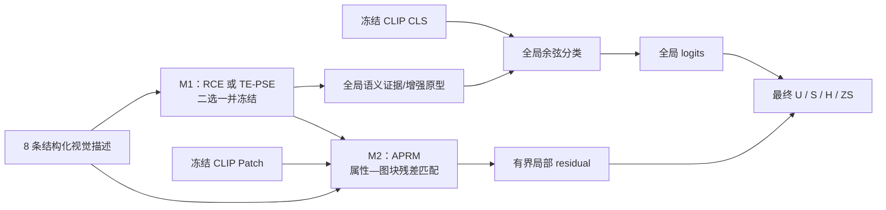

# GTPJ 自有模块实验长期清单

```text
status: active
last_verified: 2026-08-15
primary_target: CUB official GZSL H >= 75
framework_direction: frozen CLIP global path + one independently verified module at a time
```

## 1. 本文件怎么用

这是一份跨对话保留研究上下文的长期清单，不替代正式实验目录、`PARAMETER_MATRIX` 和 Warehouse 原始产物。

- 只把已经有真实结果或直接代码证据的内容写成“已确认”；计划、猜想和论文创新候选必须显式标记。
- 每次只加入一个模块。先记录无该模块的基线，再记录仅增加该模块的结果；偏置校准、adapter 和局部分支不得同时混入模块因果实验。
- 所有结果必须写完整 `U/S/H/ZS`。不允许只写“76+”；必须说明它是 `U`、`S`、`H`、`ZS`、validation 还是 official test。
- validation 用于选择，official test 用于冻结后的最终报告。test-oracle 只能写成诊断上限，不能替代 validation-selected 结果。
- 新结果完成后在本页更新一行摘要，并链接正式实验目录；原始日志、checkpoint 和 cache 仍留在 Warehouse。

## 2. 当前目标与尚未冻结的问题

- [x] 底座方向：冻结 CLIP 图像特征与全局分数。
- [x] 文本角色：`6 个局部部位 + 1 个 unique + 1 个 overall/global`。
- [x] 研究方式：模块逐个加入，单变量验证；无效就停止，不堆叠补救组件。
- [x] 最终指标目标：official GZSL `H >= 75`。
- [ ] 明确“每个模块提升 10%”指相对百分比还是绝对百分点；未明确前只报告真实 `ΔH`，不把 10% 当完成事实。
- [ ] 最终需要 3 个可解释模块；模块 2、3 只能在模块 1 通过后再冻结设计。

## 3. 指标口径，禁止混淆

| 字段 | 含义 | 能否叫最终 GZSL 成绩 |
|---|---|---|
| `U` | unseen 图像在 seen+unseen 联合类别空间中的宏平均准确率 | 不能单独代表最终成绩 |
| `S` | seen 图像在 seen+unseen 联合类别空间中的宏平均准确率 | 不能单独代表最终成绩 |
| `H` | `U` 与 `S` 的调和平均 | 是，本项目主指标 |
| `ZS` | unseen 图像只在 unseen 类中分类的准确率 | 不是 GZSL H |
| pseudo-validation H | 类不重叠伪 GZSL 上的选择指标 | 不是 official test H |
| test-oracle H | 直接在 test 上选参数得到的上限 | 只能作诊断，不能作无 test 调参结果 |

## 4. 已确认结果快照

### 4.1 当前干净文本/PSE路线

| 条件 | U | S | H | ZS | 说明 |
|---|---:|---:|---:|---:|---|
| GPT-5.6 八句纯 CLIP 等权原型 | 63.0379 | 65.3311 | 64.1640 | 80.3012 | 当前八句原始基线 |
| GPT-5.6 八句 SharedPSE | 63.2332 | 74.9939 | 68.6133 | 79.6711 | official test；PSE `ΔH=+4.4492` |
| GPT-5.6 同角色七句 SharedPSE | 63.1858 | 74.6629 | 68.4466 | 79.4469 | 已包含 unique，删除的是 overall |
| GPT-5.5 同角色七句 SharedPSE | 65.5572 | 75.0977 | 70.0039 | 82.2628 | 比 GPT-5.6 同角色七句高 `1.5573 H` |
| GPT-5.5 八句 SharedPSE | - | - | - | - | **缺失单元**：旧缓存没有 overall 句，不能拼接 GPT-5.6 句冒充公平对照 |

结论：GPT-5.5 与 GPT-5.6 七句的 `1.5573 H` 差距中，纯 CLIP 文本原型已贡献 `1.3824 H`，PSE 增益只相差 `0.1750 H`。主要差异来自文本，而不是 PSE 在两个版本上产生了完全不同的学习收益。GPT-5.6 八句比其同角色七句只高 `0.1667 H`，不能说第八句拉低了最终结果。

ABLATION-014 运行提交：`c8fcd79c611183bd9acbbd57001a63e50649cced`；结果账本提交：`d7758c5`；正式分支：`exp/v5/ablation/ablation-014-pse-text-source`。

### 4.2 当前 SharedPSE 怎么运作，为什么只作为过渡基线

当前 GPT-5.6 八句 SharedPSE 的输入是每类 `8×768` 的归一化句向量，计算顺序是：

1. 每个类别内部的八句话经过共享的 4-head self-attention。
2. 把 attention 输出经过线性投影后加回原句，得到八个上下文化角色向量。
3. 共享 role scorer `768→192→1` 为八个角色计算 softmax 权重，再加权汇总成一个候选 prototype。
4. 原始 base prototype 是八句话的等权平均；最终 prototype 为
   `normalize(base + g × (pooled - base))`，其中 `g=0.35×tanh(a)`，所以变换幅度有界。
5. seen 和 unseen 使用完全相同的模块与参数；图像 CLS 与全部类别 prototype 做余弦相似度，再除以 `temperature=0.05` 得到 logits。
6. 约 310 万个 PSE 参数只用 seen 训练样本的 CE 学习，checkpoint 由 seen 训练集内部 10% validation CE 选择。

正式 RUN-002 学到的实际 gate 为 `-0.0868`，变换后的 prototype 与原始 prototype 平均余弦约为 seen `0.99683`、unseen `0.99685`，说明它是小幅旋转而不是旧 PSE 那种强重写。但细微旋转仍会改变相邻类别的决策边界：相对纯 CLIP，`U +0.1953`、`S +9.6627`、`H +4.4492`、`ZS -0.6301`。因此当前收益主要是 seen 拟合增强，不是 unseen 语义能力同步提高。

它比旧 PSE 多了 role scorer、有界 gate 和 seen/unseen 同式处理，但仍保留“句间 self-attention → 句子汇总 → residual prototype”主骨架。再结合 ABLATION-012 中 learned attention 相对 Uniform 只有 `+0.0036 H`，attention/role 权重不能直接当作可靠因果解释。因此 SharedPSE 只作为强过渡基线，不作为最终自有创新。

### 4.3 旧 PSE 的历史服务器证据

这两组共 16 个 RUN 的 `training.log` 和 `result.yaml` 已只读核对、未发现 traceback，但旧 GitHub 轻量账本仍未回填，且没有 `artifact_manifest.json`。在完成历史结果登记前，按“已验证历史诊断”使用，不冒充新确认实验。

| 问题 | 条件 A | 条件 B | 结论 |
|---|---:|---:|---|
| learned attention 是否比均匀聚合有效 | Uniform `H=74.1443` | Learned/no-QK-decay `H=74.1479` | 只差 `+0.0036 H`；Q/K 学成非均匀后没有实际精度收益 |
| 旧 PSE 能否直接处理 unseen | seen 用 PSE、unseen raw `H=74.1392` | seen/unseen 共用旧 PSE `H=58.7478` | 共用后 `-15.3914 H`；旧强变换不能直接迁移 unseen |

旧 global-only / ABLATION-012 / ABLATION-013 中出现过 `S=76~77+`，但对应的 `H` 约为 `74.1~74.35`。如果“76+”指的是这些记录，它是 seen 准确率 `S`，不是最终主指标 `H`。

### 4.4 “77/76+”新诊断的真实含义

本地 `.runtime/local_fair_calibration/class_disjoint/RUN-001/` 的结果是调试级 class-disjoint validation diagnostic，不是正式 confirmation。

| 路径 | pseudo-validation H | official test H | 说明 |
|---|---:|---:|---|
| CLIP + validation gamma | 69.1107 | 65.7532 | 只做 seen-bias 校准 |
| SharedPSE + validation gamma | 72.6113 | 70.4942 | 没有 visual adapter |
| SharedPSE + visual adapter + gamma | **77.8696** | **74.9485** | validation 选择 `epoch=55, mix=0.2, gamma=0.3` |

不能把 `77.8696` 说成 official test，也不能说“没有调参”：

- 该脚本在 pseudo-validation 上比较了 `4026` 个 epoch/mix/gamma 候选。
- 本轮脚本没有用 final test 选择候选，但 adapter 结构、hidden、scale、优化器和搜索范围来自此前已经看过 test 的探索，因此证据级别仍是 diagnostic。
- visual adapter 是一个 `768→192→768` 的图像 CLS 残差 MLP，残差 scale 固定为 `0.2`；validation 又选择只混入 `0.2` 的 adapted logits。它先明显强化 seen 判别，但也同步扩大 seen bias。
- adapter 未加 gamma 时 official test 为 `U=55.4494 / S=86.6042 / H=67.6104`；gamma 把 seen 偏置重新平衡为 `U=67.5399 / S=84.1826 / H=74.9485`。高分主要来自“可训练 visual adapter + seen-bias 校准”的组合，不是 PSE 单模块突然达到 77+。
- `S=84.18`、`ZS=82.13` 也都不能替代 `H=74.95`。

“没有调参”也必须分开说：SharedPSE 的 `H=68.6133` 本轮没有做超参数 sweep，但继承了已有的 heads、gate cap、temperature、学习率等设定；旧 ABLATION-012/013 每个 epoch 看 official test H 选最佳 checkpoint，属于 test-exposed；visual adapter 的 `77.8696` 则明确来自 4026 个 validation 候选，三者都不能简化成“完全没调参就到 76+”。

## 5. Enhance GPT-4 论文的真实方法边界

来源：`PAPER-2023-VDT-Adapter / Enhancing CLIP with GPT-4: Harnessing Visual Descriptions as Prompts`；[官方代码仓库](https://github.com/mayug/VDT-Adapter)。

论文的 CLIP-A-self 核心是：

1. 让 GPT-4 先提出视觉判别属性，再为每个类别、每个属性生成一句 VDT 描述。
2. 用冻结 CLIP 文本编码器得到每类 `M` 个句子向量。
3. 对同一类别内的 `M` 句做 Q/K/V vanilla self-attention。
4. 将 self-attention 的 `M` 个输出直接平均。
5. 论文公式用残差比例 `β` 把 attention 均值与原始句子均值融合，训练时只优化 adapter，并用 base 类 16-shot CE 监督。

必须区分论文公式与官方代码的工程实现：论文写的是“attention 后均值 prototype 与原始均值 prototype 做外层 residual”；官方实现是 1-head QKV attention 后，先在每句话上按 residual ratio 混合、做 LayerNorm，再对句子求均值。两者细节不完全相同，但都属于“同类句间 self-attention 学习文本 prototype 聚合器”。本项目旧 PSE 的 4-head、内外两层 residual、seen 适配而 unseen raw 又是进一步工程变体，不能把这些变体冒充与来源无关的新方法。

论文/官方代码还明确说明：

- CUB 使用 16-shot Base-to-New，论文的 Base/New/H 不是本项目 200 类联合空间的 GZSL U/S/H。
- CUB 的 GPT-4 CLIP-A-self 为 `Base=78.6 / New=71.3 / H=74.77`；`77.78` 是论文表中 12 个数据集平均 Base/New 的调和结果，不是本项目 CUB official GZSL H。
- 官方 README 说明 residual ratio 必须按 dataset/shot setting 调整；论文也写明 adapter 实验会调 `β`。因此它不是“完全未调参”。
- 上述数值只标为论文报告值，本项目尚未复现。公开 Base-to-New 脚本的 new 步骤表面上仍调用训练入口而不是明确的 base-checkpoint eval-only，严格无泄漏复现协议尚有疑点，不能把官方表值当作本项目已验证基线。

### 5.1 不能再作为本项目核心创新的部分

- GPT/LLM 生成多条视觉描述。
- 同类句子 Q/K/V self-attention。
- attention 输出求平均形成类别 prototype。
- attention prototype 与原始均值按 `β` 做 residual blend。
- 把 attention 权重直接解释为属性重要性。

这些可以作为来源与 baseline 使用，但不能改名后写成自己的核心创新。当前旧 PSE 与该方法同源；当前 SharedPSE 虽增加 role scorer 和有界 gate，仍保留“句间 attention + 汇聚 + residual prototype”主骨架，所以也只作为过渡基线，不作为最终自有模块。

## 6. 自有模块 1 候选：RCE

暂定名：**RCE，Role-Contrastive Evidence（角色对比证据）**。不沿用 PSE 名称，避免把来源方法换名包装成自有模块。

状态：候选设计，尚未实现、尚未验证、尚未完成全量文献新颖性检索。

### 6.1 最小结构

由 S0 在进入 M1 前冻结 `global_anchor`；首选 `overall/global` 句，也可以沿用已冻结的全局原型，但不能在 M1 内同时更换。其余七个证据角色固定为 `6 个局部部位 + unique`。

对图像 `x`、候选类别 `c`：

```text
global_score(c) = cosine(x, global_anchor[c])
role_score(c, r) = cosine(x, text[c, r])
rival(c, r) = 同一角色 r 上得分最高的其他类别
margin(c, r) = role_score(c, r) - role_score(rival(c, r), r)
final_score(c) = global_score(c) + lambda * mean_r(margin(c, r))
```

第一版固定 `lambda=1`，七个角色等权，不加入 Q/K/V、role MLP、负残差 gate、类别专属参数或 visual adapter。

每个角色的真实贡献就是：

```text
contribution(c, r) = lambda * margin(c, r) / 7
```

删除该项且不重新归一化，最终 logit 的变化必须严格等于这项 contribution。解释输出应包含：角色名、目标类别相似度、同角色最强竞争类、竞争相似度、正/负贡献。

### 6.2 与 Enhance GPT-4 的结构差异

| 维度 | Enhance GPT-4 / CLIP-A-self | RCE 候选 |
|---|---|---|
| 核心运算 | 同类句子 Q/K/V self-attention | 同角色目标类与竞争类 margin |
| 汇聚 | attention 输出 token 求平均 | 七个有符号证据直接加到 global logit |
| 残差 | attention prototype 与 raw mean 用 `β` 混合 | 不做 prototype residual；首版 `lambda=1` |
| 解释 | attention 权重的定性解释 | 每项是最终 logit 的真实加数，可精确删除验证 |
| seen/unseen | base 上训练 adapter，再迁移 new | 同一无类别专属公式处理所有候选类 |
| 评估 | 16-shot Base-to-New | 本项目 official GZSL `U/S/H/ZS` |

这能确保当前候选在核心计算图上不同于该论文，但不能替代对全部相关文献的 novelty 检索。未完成检索前不得写“首创”或 SOTA。

### 6.3 RCE 被选中时的 M1 最小验证组合

| 顺序 | 条件 | 唯一变化 | 回答的问题 |
|---|---|---|---|
| `M1-E0` | frozen global anchor | 无 RCE | 同口径零号基线是多少 |
| `M1-E1` | global anchor + RCE，`lambda=1` | 只加逐角色同角色 rival margin | RCE 原始形式能否提高 H |
| `M1-C1` | no-contrast | 用目标类角色相似度代替 rival margin | 收益是否真的来自类别竞争 |
| `M1-C2` | wrong-role rival | rival 使用预先固定的错位角色 | 收益是否依赖正确角色对齐 |
| `M1-X1` | top contribution deletion vs matched-random deletion | 不重训，只删除解释项 | 声称的重要角色是否真的更影响最终 logit |

只有最终选择 RCE 作为 M1 时才执行本表。先跑 `M1-E0/E1`；只有 E1 有正增益才跑两个机制 control，control 通过后才做第二 seed / exact repeat。任何阶段都不混入 visual adapter、gamma 或局部分支。结构不同现在可以确认，能否达到旧 PSE 约 74 的效果必须由这些真实实验决定，不能提前保证。

### 6.4 可以与不可以声称什么

如果实验通过，可以声称：

- 无 attention 的、seen/unseen 对称的角色竞争证据校准。
- 每个文本角色对最终 logit 的贡献可加、可审计、可做精确反事实删除。
- 若正确角色竞争优于 no-contrast 和 wrong-role control，可说收益依赖角色对齐的竞争证据。

不可以声称：

- CLIP CLS 真正定位或观察了鸟嘴、翅膀、尾巴的空间区域。
- 文本角色贡献等同人类因果解释。
- 单 seed 提升代表稳定结论。
- 未做文献检索就声称方法是全球首次提出。

## 7. 对话候选补充：TE-PSE 与 APRM

```text
status: dialogue_candidate_not_frozen
source: owner-provided conversation summary
rule: historical facts may be reused; proposed mechanisms must be frozen and tested before being called project methods
```

### 7.1 这段对话保留下来的历史事实

| 证据 | 已确认结果 | 正确含义 |
|---|---|---|
| `TRIAL-001 / ATTEMPT-019` | `U=71.32 / S=77.52 / H=74.29 / ZS=81.59`；相对 v1 authoritative baseline `ΔH=+0.36` | PSE 作为当时实验变量确实跑过并达到约 74；状态是 `revise`，不是 promotion，也不是纯 `CLIP+PSE` |
| ABLATION-001 去局部分支 | 三 seed 的 H 为 `73.92 / 74.14 / 74.03`，均值约 `74.03` | 删除 FGVD/BVSA/SGMP/局部融合与局部损失，但仍保留 PSE、ICSA、CE、topology，不能写成 PSE-only |
| ABLATION-001 完整 vs 去局部 | `H=74.11` vs `74.03`，完整局部分支平均只高 `0.08 H` | 旧局部分支复杂但没有证明稳定贡献，应退出新底座 |
| INNOVATION-005 混淆属性局部诊断 | 相对每次自身 global logits 平均 `+0.2542 H`，三次均 rescue 多于 harm | 说明“小幅局部残差纠错”值得继续验证；总 H 仍比完整 V5 均值低 `0.0513`，不是强局部模块证据 |

因此缺口不是“再证明旧 PSE 跑得动”，而是建立一个干净底座，在同一数据、文本、选模和评估口径下，将来源方法与自有方法严格分开。

### 7.2 TE-PSE：对话提出的全局语义候选

暂定名：**TE-PSE，Transferable Evidence-Calibrated PSE（迁移式证据校准语义增强）**。

它针对旧 PSE 的真实问题：训练信号只来自 seen，强 prototype 变换容易向 seen 漂移；旧 Shared-Unseen 实验已经出现 `H -15.3914` 的迁移崩溃。候选由三项组成：

1. **角色判别证据**：同一角色下，目标类别越能区别于易混淆类别，证据越高；各类都相似的空泛描述降权。
2. **seen/unseen 共享函数**：相同的、无类别专属参数的评分/变换原样处理所有类别；训练不使用 unseen 图像或标签。
3. **置信度控制漂移**：角色证据冲突时靠近原始 CLIP anchor；证据一致且有区分力时才允许更大移动，并报告移动幅度。

要求输出：逐角色证据、最强混淆类别、正/负贡献、原型移动余弦或范数、漂移 gate。

当前状态只是问题定义，不是可运行方法：权重公式、共享变换和漂移置信度尚未冻结，也尚未完成相关工作检索。若最终仍采用 Q/K/V self-attention、句子学习式汇聚和 `raw prototype + learned prototype residual`，它就会重新落回 CLIP-A-self/PSE 主骨架，不能仅凭“证据校准”改名成为自有创新。

**与 RCE 的关系**：RCE 是“角色判别证据”的一个已经写出公式的最小、无 attention 实现；TE-PSE 是包含共享变换和漂移控制的更宽候选。两者属于 M1 的竞争方案，不能在第一轮同时叠加后把收益都归给一个模块。实现前必须二选一并冻结唯一计算图；若选择 TE-PSE，需要先补齐精确公式，再重新与 Enhance GPT-4 做结构审查。

| 方案 | 现在已经明确的部分 | 仍缺什么 |
|---|---|---|
| RCE | 图像相关的同角色 rival margin；score-level 精确加法；无训练参数 | 全量相关工作检索与真实精度 |
| TE-PSE | 判别证据、共享迁移、置信漂移三条设计原则 | 精确公式、是否训练 prototype、损失、参数量、贡献分解和新颖性检索 |

### 7.3 APRM：对话提出的局部模块候选

暂定名：**APRM，Attribute-to-Patch Residual Matching（属性—图块残差匹配）**。

最小计算只做一件事：

```text
7 个局部/unique 角色文本
    -> 与冻结 CLIP patch 做余弦匹配
    -> 每个角色固定规则选择少量 top-k patch
    -> 用已冻结的 M1 角色证据或等权规则汇总
    -> 形成有界局部 logit residual
    -> 加到冻结的全局分数
```

第一版禁止加入频域筛选、双向 Transformer、重建网络、多种辅助损失或新的动态融合器。如果 M1 不产生角色权重，APRM 必须使用预先固定的等权规则，不能在 APRM 内偷偷新增第二套语义加权器。

可解释输出包括：角色对应的 patch 索引/位置、每个 patch 相似度、该角色对类别 logit 的真实残差、纠正的误判和新增的误判。它只能声称“这些 patch 分数参与了决策”，不能仅凭相似度图声称模型真的定位了人类定义的鸟类部位。

APRM 的动机由 INNOVATION-005 的 `+0.2542 H` 小幅残差纠错支持，但这不是 APRM 已有效的证据。属性—patch 匹配本身也是常见方向，必须完成相关工作检索后才能判断新颖性。

### 7.4 对话提出的目标框架



这是目标关系图，不是当前已实现框架。第一阶段只确定 M1；M1 通过后才允许实现 APRM。APRM 两个 seed 都没有明确正收益就整块删除，不围绕旧局部分支继续修补。第三创新目前不冻结；seen-bias calibration 仍是评估工具，不冒充创新模块。

### 7.5 严格可比的最小版本

| 版本 | 内容 | 用途 |
|---|---|---|
| `B0` | CLIP + 冻结的原始句子/global anchor | 干净零号基线 |
| `B1` | B0 + 同文本、同底座复现的 CLIP-A-self | 来源方法参考，不是自有创新；开跑前必须写明采用论文公式还是官方代码实现 |
| `M1` | B0 + 最终二选一并冻结的 RCE 或 TE-PSE | 验证自有全局语义模块 |
| `M2` | 冻结 M1 + APRM | 只验证局部残差的独立贡献 |

旧 TRIAL-001 和 ABLATION-001 可以提供历史锚点，但因底座和伴随模块不同，不能代替上述同口径 `B0/B1/M1`。

## 8. 模块队列：严格一个一个加

| 顺序 | 模块 | 当前状态 | 进入条件 | 禁止混入 |
|---|---|---|---|---|
| S0 | 冻结文本与纯 CLIP 全局底座 | 进行中 | 补齐 GPT-5.5 八句，完成 5.5/5.6 × 7/8 的 2×2 | PSE、adapter、bias、局部分支 |
| B1 | 论文式 CLIP-A-self 同口径参考 | 待复现或绑定可比证据 | S0 冻结；与 B0 只差来源 adapter | 自有模块、局部分支、bias |
| M1 | 自有全局语义模块：RCE 或 TE-PSE 二选一 | 候选竞争，未冻结 | S0 文本版本与 global anchor 冻结；唯一计算图完成文献与结构审查 | 另一候选、visual adapter、gamma、局部分支 |
| M2 | APRM 属性—图块残差匹配 | 对话候选，未冻结实现 | M1 多 seed 通过并固定 | FGVD、BVSA、SGMP、动态融合、第三模块 |
| M3 | 全局/局部可靠性融合 | 仅方向，未冻结设计 | M2 证明有独立增益 | 新的语义模块 |
| C0 | seen-bias calibration | 独立评估工具，不算创新模块 | 每个冻结模型先报告 gamma=0，再在 validation 选一个 gamma | 不得用来掩盖模块原始退化 |

M2、M3 当前只记录研究位置，不提前堆代码。它们的具体机制必须等前一模块结果出来后重新质疑和设计。

## 9. 每个模块的实验检查清单

### 8.1 开跑前

- [ ] 写一句可证伪问题：模块为什么应该提高哪个指标。
- [ ] 绑定唯一 clean commit、配置、seed、数据/划分哈希和 class order。
- [ ] 参数表中有 `module OFF` 与 `module ON`，除模块外完全一致。
- [ ] 先跑无 adapter、无 bias、无局部分支的原始模块效果。
- [ ] checkpoint 只由训练内部或类不重叠 validation 选择；official test 冻结后一次。
- [ ] 预先写明机制 control 和失败即停止条件。

### 8.2 结果必须回答

- [ ] 完整 `U/S/H/ZS` 和 `ΔH`。
- [ ] 提升来自 U、S 平衡，还是只抬高 seen。
- [ ] ZS 是否下降，是否出现 unseen 语义破坏。
- [ ] 模块贡献能否由其声明的解释量精确复现。
- [ ] top-evidence 删除是否比 matched-random 删除伤害更大。
- [ ] no-contrast / wrong-role 等控制是否失去收益。
- [ ] seed 5 有真实信号后再做 seed 17 与 exact repeat。

### 8.3 保留或停止

- `keep_candidate`：同口径 H 提升，U/ZS 无不可接受坍缩，核心 control 支持机制，解释与真实 logit 变化一致。
- `revise_once`：有稳定信号，但只存在一个明确可修复的问题；只允许一次最小改动。
- `stop_no_gain`：H 不升，或提升完全来自 bias/adapter，或解释量与真实贡献不一致。

## 10. 当前待办

- [ ] 找到 GPT-5.5 原始生成提示词与文本源，只补 200 类 `overall_appearance`，编码得到 GPT-5.5 八句缓存。
- [ ] 完成 GPT-5.5 八句纯 CLIP 与 SharedPSE 对照，补齐 2×2；该实验只用于冻结文本，不把 SharedPSE 当最终创新。
- [ ] 把 ABLATION-012/013 的历史服务器结果按其实际证据级别回填旧账本。
- [ ] 冻结 S0 的 global anchor：明确使用 overall 句还是现有全局原型，不能在 M1 内同时更换。
- [ ] 在 RCE 与 TE-PSE 之间冻结 M1 的唯一方案；如果选 TE-PSE，先补齐逐步公式、参数和 exact contribution 定义。
- [ ] 为 M1 做相关工作检索，至少检查 role-wise additive scoring、class-rival margin、confidence-bounded prototype adaptation 和 explainable ZSL 是否已有等价方法。
- [ ] 检索无直接等价并完成与 Enhance GPT-4 的结构复核后，创建一个正式 innovation 实验，只实现 M1。
- [ ] M1 原始结果通过后，再单独做 validation-selected bias；两组结果分开报告。
- [ ] 只在 M1 多 seed 通过后冻结 APRM；检索 attribute-patch matching 相关工作，并以 `M1 OFF/ON APRM` 做唯一变量比较。

## 11. 证据入口

- 论文登记与本地 PDF 身份：`idea_tree/sources/papers_index.md` 中的 `PAPER-2023-VDT-Adapter`。
- 旧 CLIP-A-self / PSE 来源与工程变体：`idea_tree/ideas/IDEA-0001_clip_a_self_text_prototype/`。
- 当前 GPT-5.5/5.6 文本对照：分支 `exp/v5/ablation/ablation-014-pse-text-source`，运行提交 `c8fcd79c611183bd9acbbd57001a63e50649cced`，结果账本提交 `d7758c5`。
- 本地 class-disjoint adapter 诊断：`.runtime/local_fair_calibration/class_disjoint/RUN-001/fair_comparison.json`；该文件是本地 debug evidence，不是 GitHub 正式账本。
- ABLATION-012/013 的完整训练日志与 `result.yaml` 位于服务器 Warehouse；GitHub 轻量账本尚未回填，回填前不得把占位状态当作真实未运行。
- PSE 历史最好结果：`experiments/module_trials/IDEA-0001_clip_a_self_text_prototype/TRIAL-001_clip_a_self_residual_seenonly/result.md`。
- 旧局部分支贡献：`experiments/v5/ablation/ABLATION-001_local_branch_effect/README.md` 与同目录参数矩阵。
- APRM 动机的历史局部诊断：`experiments/v5/innovation/INNOVATION-005_confusion_attribute_contrast/result.md`。

## 12. 更新模板

每次完成真实 RUN 后，在本节顶部追加，不覆盖旧条目：

```text
date:
experiment_id:
commit:
only_changed_factor:
text/data/split identity:
selection protocol:
U/S/H/ZS:
raw delta_H:
calibrated delta_H:  # 若未做写 none
mechanism checks:
decision:
formal result path:
next single action:
```
