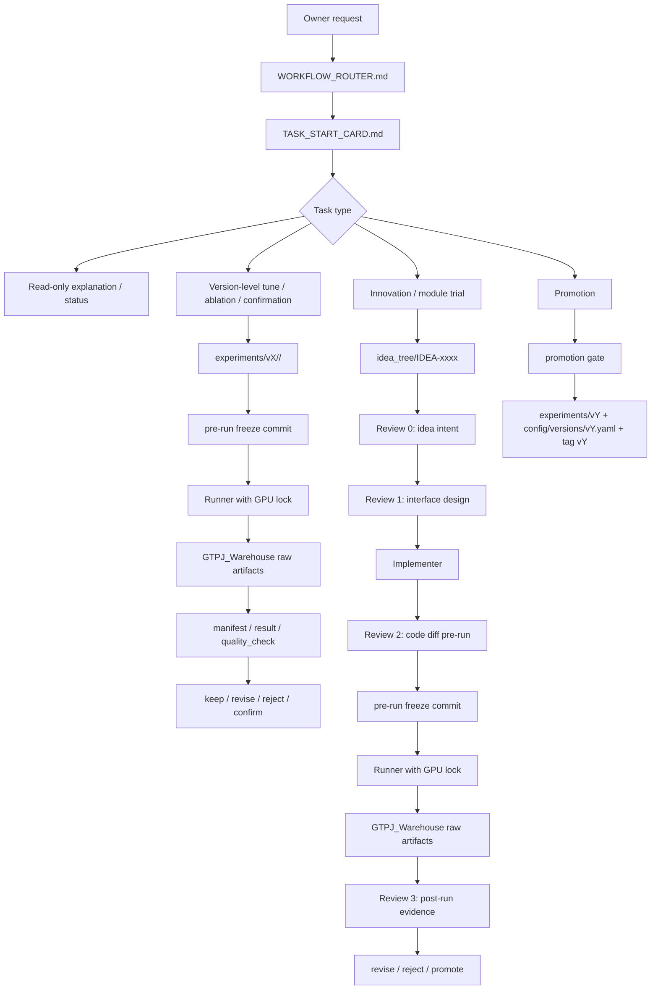
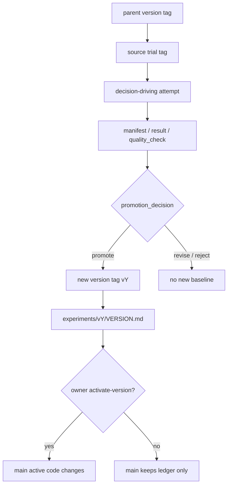
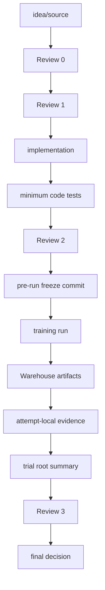

# Workflow Diagrams

本文规定 GTPJ 流程图放在哪里、必须画什么、什么时候更新。

## 当前结论

当前仓库在本规则落地前没有独立的流程图文件，也没有稳定的 Mermaid / draw.io 版本流程图。已有的是文字版版本树，例如：

```text
experiments/VERSION_TREE.md
docs/workflow/versioning.md
```

以后不要只靠文字描述版本和实验链路。每个正式版本、每个会改变代码语义的 module trial，都必须有轻量流程图。

## 存放规则

GitHub 中的权威流程图优先使用 Markdown + Mermaid，原因是：

- 可 diff。
- 可 review。
- 可和版本账本一起提交。
- 不依赖外部图片文件。

推荐位置：

```text
experiments/vX/VERSION.md
experiments/module_trials/IDEA-xxxx_slug/TRIAL-xxx_slug/README.md
docs/workflow/workflow_diagrams.md
```

复杂图可以单独放：

```text
experiments/vX/flow.md
experiments/module_trials/IDEA-xxxx_slug/TRIAL-xxx_slug/flow.md
```

生成出来的 PNG、HTML、临时截图默认不是权威证据。除非它是小型稳定文档资产，否则不要提交到 GitHub；大图、渲染图和临时可视化进入 `GTPJ_Warehouse`，GitHub 只记录引用。

## Owner 可视化交付

仓库中的权威流程图仍优先使用 Markdown + Mermaid，方便 diff、review 和随账本提交。

但给 owner 解释模型框架、代码路径、实验链路或流程差异时，默认再生成一个可本地打开的 HTML 视图，并在回复中给出 `file:///D:/.../xxx.html` 形式的绝对本地链接，例如：

```text
file:///D:/backup/Documents/xwechat_files/wxid_gv04544qttp922_8f75/msg/file/2026-06/FRAMEWORK_DIAGRAM_BASELINE(2).html
```

HTML 视图用于阅读和沟通，不自动成为实验事实源。若该 HTML 需要长期留档，优先放入 `GTPJ_Warehouse/diagrams/` 或对应外部 artifact 目录；GitHub 只记录轻量引用、哈希或说明。

## 必填图

每个正式版本 `experiments/vX/VERSION.md` 必须包含：

```text
## Version Flow
```

图里至少标出：

- `parent_version`
- `parent_tag`
- `based_on_trial`
- `source_attempt` 或 baseline source
- `code_tag`
- `evidence_level`
- `confirmation_status`
- 是否是当前 owner active mainline

每个新 module trial `README.md` 必须包含：

```text
## Trial Flow
```

图里至少标出：

- idea/source
- Review 0
- Review 1
- implementation
- Review 2
- pre-run freeze commit
- Runner
- Warehouse artifact registration
- Review 3
- final decision

## 总流程框架



## 版本流程框架



## Module Trial 流程框架



## 更新规则

以下情况必须更新流程图：

- 新增正式版本 `vX`。
- 修改某个版本的 `parent_version`、`based_on_trial`、`code_tag` 或 confirmation 状态。
- 新 module trial 落成代码改动。
- trial 的决策从 `revise` / `reject` 变成 `promote`。
- promotion 创建新版本材料。

如果图和文字账本冲突，以 `result.yaml`、`manifest.yaml`、`experiments/VERSION_TREE.md` 和当前 Git tag 为事实源，先修正文字账本，再修正图。
