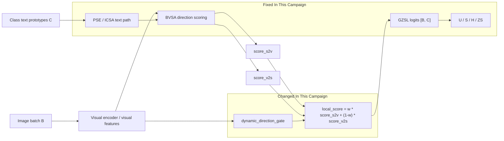

# Campaign Run Map

This campaign stays inside `IDEA-0003 / TRIAL-001 Dynamic Residual Routing`.
It does not introduce a new forward path, loss, dataset split, label mapping,
class order, or metric definition.

This is not a new-method framework diagram. Formal method framework diagrams
belong to `experiments/vX/framework_diagram.md` or the owning
`experiments/module_trials/.../TRIAL-xxx/framework_diagram.md`.

Formal result evidence for this campaign is recorded under:

```text
experiments/module_trials/IDEA-0003_dynamic_residual_routing/TRIAL-001_dynamic-routing/attempts/ATTEMPT-006/
```

Trial-level framework reference:

```text
experiments/module_trials/IDEA-0003_dynamic_residual_routing/TRIAL-001_dynamic-routing/framework_diagram.md
```

## Diagram



## Variables

| Symbol | Config field | Meaning |
|---|---|---|
| `h` | `dynamic_gate_hidden` | Hidden width of the dynamic direction gate MLP. |
| `w` | `weight_s2v` | Base score-mix weight: `local_score = w * score_s2v + (1-w) * score_v2s`. |
| `a` | `dynamic_gate_anchor_lambda` | Anchor loss weight that keeps dynamic gates near the fixed anchor. |
| `sample` | `dynamic_direction_mode=sample` | Gate can vary per image/sample. |
| `class` | `dynamic_direction_mode=class` | Gate varies by class/prototype signal. |

## Workstream Frames

| Workstream | Work items | Changed switches | Meaning |
|---|---|---|---|
| Innovation probes | INNOV-001, INNOV-002 | Existing local/direction/PSE gate combinations | Switch probes inside the current trial, not new paper-derived modules. |
| Direction tune | TUNE-001..TUNE-008 | `dynamic_direction_mode`, `dynamic_gate_hidden`, `weight_s2v`, `dynamic_gate_anchor_lambda` | Narrow config search around the best direction-gate region. |

## GZSL Hard Rules

- Seen/unseen split unchanged.
- Label mapping unchanged.
- Class order unchanged.
- Metric semantics unchanged.
- Logits remain `[B（图片/样本数量）, C（类别数量）]`.
- `dynamic_pse_mode=sample` remains forbidden.
