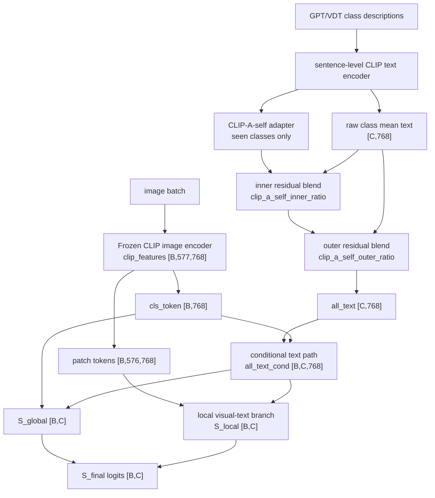

# Framework Diagram: IDEA-0001 / TRIAL-001

```text
trial_id: TRIAL-001
idea_id: IDEA-0001
base_version: v1
promoted_to: v2
code_path: CLIP-A-self sentence-level text prototype adapter
code_vs_intent: implemented as a seen-class text prototype adapter behind use_clip_a_self.
```

## Main Forward Flow



## Variable Glossary

| Variable | Produced by | Consumed by | Shape | Meaning | Gradient boundary | Train/eval difference |
|---|---|---|---|---|---|---|
| `sentence_text_features` | CLIP text encoder | CLIP-A-self adapter and raw pooling | `[C,N,768]` conceptually | per-class sentence features before pooling | trainable adapter consumes fixed text features | same train/eval |
| `all_text` | CLIP-A-self residual blend | scorer and conditional text path | `[C,768]` | adapted class text prototypes | gradients reach the adapter when enabled | unseen path remains raw when `clip_a_self_apply_unseen=false` |
| `all_text_cond` | conditional text path | global/local scoring | `[B,C,768]` | per-image text prototypes | follows existing base behavior | same shape train/eval |
| `S_global` | global scorer | final fusion | `[B,C]` | global class score | normal gradient | train may slice seen classes for CE |
| `S_local` | local branch | final fusion | `[B,C]` | local class score | normal gradient | train may slice seen classes for CE |

## Method Glossary

| Method / module | Code location | Inputs | Outputs | Responsibility | Config switch | Baseline-off behavior |
|---|---|---|---|---|---|---|
| `CLIPASelfAdapter` | `model/MyModel.py` | sentence-level text features | adapted seen-class text | self-attention over class text sentences | `use_clip_a_self` | disabled returns the v1 text path |
| Text-cache path | `train_GTPJ_CUB.py` | GPT/VDT text descriptions | sentence-level CLIP text cache | preserves sentence features for the adapter | `text_source` and cache setup | raw class mean text remains available |
| Residual text blend | `model/MyModel.py` | raw text and adapted text | `all_text [C,768]` | controls strength of text adaptation | `clip_a_self_inner_ratio`, `clip_a_self_outer_ratio` | ratios 0 return raw text prototypes |

## Loss Flow

No new loss is introduced by TRIAL-001. Existing CE and auxiliary losses consume the adapted text through the normal v1 scoring path.

## Code vs Intent

The owner intent was to improve text prototypes without changing GZSL evaluation semantics. The implementation keeps class order, seen/unseen split, label mapping, logits shape, and metric calculation unchanged.
