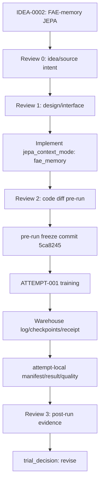

# TRIAL-001_fae_memory_jepa

```text
trial_id: TRIAL-001
idea_id: IDEA-0002
base_version: v2
base_code_tag: v2
branch_source: main
idea_source_file: idea_tree/ideas/IDEA-0002_fae_memory_jepa/IDEA.md
idea_title: FAE-memory JEPA auxiliary loss
version_score: 72.0
applicability: needs_adaptation
code_branch: dev/v2-idea-0002-trial-001-attempt-002-strict-conditional-jepa
code_tag: trial/v2/idea-0002/trial-001
code_commit: 5ca8245e37856e426407612b1a95bcdcfbd92697
trial_decision: revise
promotion_decision: not_applicable
promote_to:
evidence_level: valid_single_run
best_observed_H:
confirmed_H: pending
confirmation_status: not_applicable
changed_files:
run_config: experiments/module_trials/IDEA-0002_fae_memory_jepa/TRIAL-001_fae_memory_jepa/attempts/ATTEMPT-001/config.yaml
log_artifact_id: log:v2:module_trial:TRIAL-001:attempt-001
log_uri: warehouse://gtpj/runs/v2/module_trial/TRIAL-001/attempt-001/logs/training_log_CUB_2026-06-27_23-44-35.txt
log_sha256: c0fce9c6d031851479f7dafb7aee1db7d86cc80f3415826ced985f4c83f1b2c1
log_size_bytes: 92239
manifest: manifest.yaml
result_yaml: result.yaml
result_md: result.md
idea_intent_check: idea_intent_check.md
interface_precheck: interface_precheck.md
review_round_1: review_round_1.md
interface_check: interface_check.md
review_round_2: review_round_2.md
agent_summary: agent_summary.md
framework_diagram: framework_diagram.md
```

## 改动文件

| 文件 | 改动 | 是否属于代码层 |
|---|---|---|
| `model/MyModel.py` | Add `jepa_context_mode` and FAE-memory JEPA auxiliary path | yes |
| `experiments/module_trials/IDEA-0002_fae_memory_jepa/TRIAL-001_fae_memory_jepa/attempts/ATTEMPT-001/config.yaml` | Enable `jepa_context_mode: fae_memory` | no |
| `tests/test_fae_memory_jepa.py` | Gradient and shape smoke tests | no |
| `train_GTPJ_CUB.py` | Log `jepa_context_mode` in training header | yes |

## 结果

| 数据集 | Seed | U | S | H | ZS | Best epoch | Log |
|---|---:|---:|---:|---:|---:|---:|---|
| CUB | 5 | 70.32 | 77.68 | 73.82 | 81.39 | 34 | `log:v2:module_trial:TRIAL-001:attempt-001` |

## Trial Flow



## Framework Diagram

```text
path: framework_diagram.md
html_view: file:///D:/Backup/Documents/Myself/GTPJ_Warehouse/diagrams/IDEA-0002_fae_memory_jepa_code_vs_intent.html
code_vs_intent: ATTEMPT-001 is keep-only FAE-memory JEPA; strict main-path jepa_memory + conditional text moved to TRIAL-002.
```

## Innovation Code Review

```text
Review 0: idea_intent_check.md
Review 1: interface_precheck.md
Review 2: review_round_1.md + interface_check.md + quality_check.md
Review 3: review_round_2.md + agent_summary.md
activation_mode: real_multi_agent
```

## Promotion Gate

- [ ] baseline H、trial H、delta H 已记录。
- [ ] `evidence_level: baseline_grade`；单次最高 H 只能写 `best_observed_H`。
- [ ] clean confirmation 或多 run 稳定性证据明确，`confirmed_H` 和 `confirmation_status` 已记录。
- [ ] U/S/ZS 没有不可接受退化。
- [ ] class order、split、logits shape、metric calculation 未改变。
- [ ] switch off 能回到 `v2` 行为。
- [ ] 证据目录、外部 artifact 指针和 code.diff 完整。
- [ ] `promotion_decision` 为 `promote` 后才允许进入自动 promotion gate。

## 决策

ATTEMPT-001 completed but was `-0.47` H below active v2 `best_observed_H=74.29`
(`confirmed_H=pending`). Decision: `revise`; no promotion.

Implementation clarification: ATTEMPT-001 is a valid keep-only FAE-memory JEPA variant. In that run, `_ag_jepa_loss`
recomputed FAE over keep tokens inside the loss branch, rather than consuming the main forward path's full `jepa_memory`.

Boundary correction: the strict main-path `jepa_memory` + conditional AG-JEPA text line is now
`TRIAL-002_strict_conditional_jepa`. The former TRIAL-001 ATTEMPT-002/003 records were moved there as
TRIAL-002 ATTEMPT-001/002 with corrected Warehouse artifact ids.
