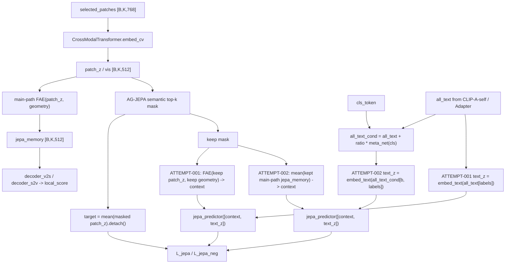

# Framework Diagram: IDEA-0002 / FAE-memory JEPA

```text
trial_id: TRIAL-001
idea_id: IDEA-0002
base_version: v2
html_view: file:///D:/Backup/Documents/Myself/GTPJ_Warehouse/diagrams/IDEA-0002_fae_memory_jepa_code_vs_intent.html
code_vs_intent: ATTEMPT-001 is keep-only FAE-memory JEPA; ATTEMPT-002 is the planned strict main-path memory + conditional text path.
```

## Diagram



## Variable Glossary

| Variable | Produced by | Consumed by | Shape | Meaning | Grad / detach | Train/eval difference |
|---|---|---|---|---|---|---|
| `selected_patches` | `lastvit_select_patches` or full patches | `embed_cv`, AG-JEPA mask | `[B,K,768]` | CLIP visual patch subset | no upstream CLIP grad | train/eval same feature source |
| `patch_z` / `vis` | `CrossModalTransformer.embed_cv(selected_patches)` | FAE, AG-JEPA target | `[B,K,512]` | pre-FAE visual patch representation | target side is detached | train/eval shape same |
| `jepa_memory` | main `CrossModalTransformer.forward` FAE | local score, ATTEMPT-002 context | `[B,K,512]` | main-path FAE visual memory | positive JEPA may update FAE | local score uses it in train/eval |
| `mask` | `_ag_jepa_loss` semantic top-k | target/context split | `[B,K]` | selected semantic patches to predict | no grad | train loss only |
| `keep` | inverse of `mask` | context split | `[B,K]` | visible context patches | no grad | train loss only |
| `all_text` | `_make_all_text()` | local score, ATTEMPT-001 AG-JEPA text | `[200,768]` on CUB | adapted class prototypes | adapter path trainable | train/eval same prototypes |
| `all_text_cond` | `meta_net(cls_token)` residual | ATTEMPT-002 AG-JEPA text | `[B,200,768]` | sample-conditioned class prototypes | positive/negative text path updates `meta_net` | only available when CLS exists |
| `context` | ATTEMPT-specific visual path | `jepa_predictor` | `[B,512]` | visual condition for JEPA prediction | positive branch trainable; negative uses detach | train loss only |
| `target` | masked `patch_z` mean | cosine target | `[B,512]` | pre-FAE masked visual target | always detached | train loss only |

## Method Glossary

| Method / module | Code location | Inputs | Outputs | Responsibility | Config switch | Baseline-off behavior |
|---|---|---|---|---|---|---|
| `CrossModalTransformer.forward` | `model/MyModel.py` | patches, all_text, cls_token | `local_score`, `jepa_patch_z`, `jepa_memory` | main cross-modal local scorer and visual memory owner | `use_fae`, LastViT switches | existing scorer unchanged |
| `GTPJ.forward` | `model/MyModel.py` | CLIP features | logits package | builds base logits, local score, JEPA auxiliary tensors | `use_conditional_text`, `jepa_text_mode` | default returns `all_text` path |
| `GTPJ._ag_jepa_loss` | `model/MyModel.py` | patches, text, labels, auxiliary tensors | `loss_jepa`, `loss_jepa_neg` | masks semantic patches and trains predictor | `jepa_context_mode`, `jepa_text_mode` | `embed` + `adapted` preserves old AG-JEPA |
| `jepa_predictor` | `model/MyModel.py` | `[context, text_z]` | predicted visual target | maps visual/text condition to target space | `use_ag_jepa` | unused if JEPA weights are zero |
| `meta_net` | `model/MyModel.py` | `cls_token` | conditional text residual | image-conditioned text adaptation | `use_conditional_text` | absent when disabled |

## Loss Flow

| Loss | Reads | Target / teacher / source | Weight key | Gradient boundary | Where it appears |
|---|---|---|---|---|---|
| `loss_jepa` | `context`, positive `text_z` | `mean(masked patch_z).detach()` | `lambda_jepa` | target detached; context/text trainable | after mask split |
| `loss_jepa_neg` | `context.detach()`, negative `text_z` | margin against positive similarity | `lambda_jepa_neg` | visual context detached; text branch trainable | after positive predictor |

## Code vs Intent

- ATTEMPT-001 is valid but should be described as keep-only FAE-memory JEPA, because `_ag_jepa_loss` re-runs FAE on keep tokens instead of consuming main-path `jepa_memory`.
- ATTEMPT-002 is planned to match the stricter owner intent: consume main-path `jepa_memory` for visual context and consume sample-conditioned text for AG-JEPA predictor.
- Both attempts keep target as detached masked pre-FAE `patch_z`; logits shape, class order, seen/unseen split, and metric calculation remain unchanged.
