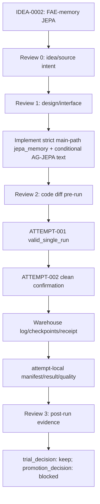

# TRIAL-002_strict_conditional_jepa

```text
trial_id: TRIAL-002
idea_id: IDEA-0002
base_version: v2
base_code_tag: v2
branch_source: dev/v2-idea-0002-trial-001-attempt-002-strict-conditional-jepa
idea_source_file: idea_tree/ideas/IDEA-0002_fae_memory_jepa/IDEA.md
idea_title: FAE-memory JEPA auxiliary loss
version_score: 72.0
applicability: needs_adaptation
code_branch: dev/v2-idea-0002-trial-002-strict-conditional-jepa
code_tag: trial/v2/idea-0002/trial-002
code_commit: 666557dd4ba03062b326d96268ccc4adcaa97d2d
trial_decision: keep
promotion_decision: blocked
promote_to:
evidence_level: confirmation_grade
best_observed_H: 74.24
confirmed_H: 74.24
confirmation_status: confirmed
changed_files:
run_config: experiments/module_trials/IDEA-0002_fae_memory_jepa/TRIAL-002_strict_conditional_jepa/attempts/ATTEMPT-002/config.yaml
log_artifact_id: log:v2:module_trial:TRIAL-002:attempt-002
log_uri: warehouse://gtpj/runs/v2/module_trial/TRIAL-002/attempt-002/logs/training_log_CUB_2026-06-28_17-55-57.txt
log_sha256: 3fbf0fbf19910f6b6bb7541df125faa5cca5c2bfa65664e726caf807059527ee
log_size_bytes: 91969
manifest: manifest.yaml
result_yaml: result.yaml
result_md: result.md
idea_intent_check: idea_intent_check.md
interface_precheck: interface_precheck.md
review_round_1: review_round_1.md
interface_check: interface_check.md
review_round_2: review_round_2.md
agent_summary: agent_summary.md
framework_diagram: framework_diagram.md
```

## Boundary Correction

TRIAL-002 was split out from TRIAL-001 because the strict path changes the trial implementation hypothesis:

- TRIAL-001 is the keep-only FAE-memory JEPA variant.
- TRIAL-002 is the strict main-path `jepa_memory` context plus conditional AG-JEPA text variant.

The historical runs originally recorded as TRIAL-001 ATTEMPT-002/003 are re-registered here as TRIAL-002 ATTEMPT-001/002. The raw logs and checkpoints are copied into TRIAL-002 Warehouse locations so later audits can follow the corrected trial identity.

## Changed Files

| File | Change | Code layer? |
|---|---|---|
| `model/MyModel.py` | Add `jepa_context_mode=fae_main_memory` and `jepa_text_mode=conditional` path | yes |
| `train_GTPJ_CUB.py` | Log JEPA context/text mode in training header | yes |
| `tests/test_fae_memory_jepa.py` | Add main-path memory and conditional-text probes | no |
| `attempts/ATTEMPT-001/config.yaml` | Strict main-path memory + conditional AG-JEPA text first run | no |
| `attempts/ATTEMPT-002/config.yaml` | Clean confirmation rerun of ATTEMPT-001 config | no |

## Results

| Dataset | Seed | U | S | H | ZS | Best epoch | Log |
|---|---:|---:|---:|---:|---:|---:|---|
| CUB | 5 | 71.32 | 77.40 | 74.24 | 81.62 | 33 | `log:v2:module_trial:TRIAL-002:attempt-002` |

## Trial Flow



## Framework Diagram

```text
path: framework_diagram.md
html_view: file:///D:/Backup/Documents/Myself/GTPJ_Warehouse/diagrams/IDEA-0002_fae_memory_jepa_code_vs_intent.html
code_vs_intent: TRIAL-002 tests strict main-path jepa_memory plus conditional AG-JEPA text.
```

## Innovation Code Review

```text
Review 0: idea_intent_check.md
Review 1: interface_precheck.md
Review 2: review_round_1.md + interface_check.md + quality_check.md
Review 3: review_round_2.md + agent_summary.md
activation_mode: real_multi_agent for the original code semantic change; later frozen reruns use role_only Runner execution.
```

## Decision

TRIAL-002 ATTEMPT-002 cleanly confirmed the strict conditional path at `H=74.24`. This is a keep result for IDEA-0002, but not a formal promotion/tag basis because the active v2 comparison value remains an unconfirmed `best_observed_H=74.29`.
