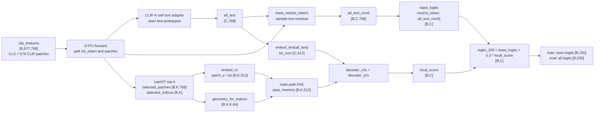
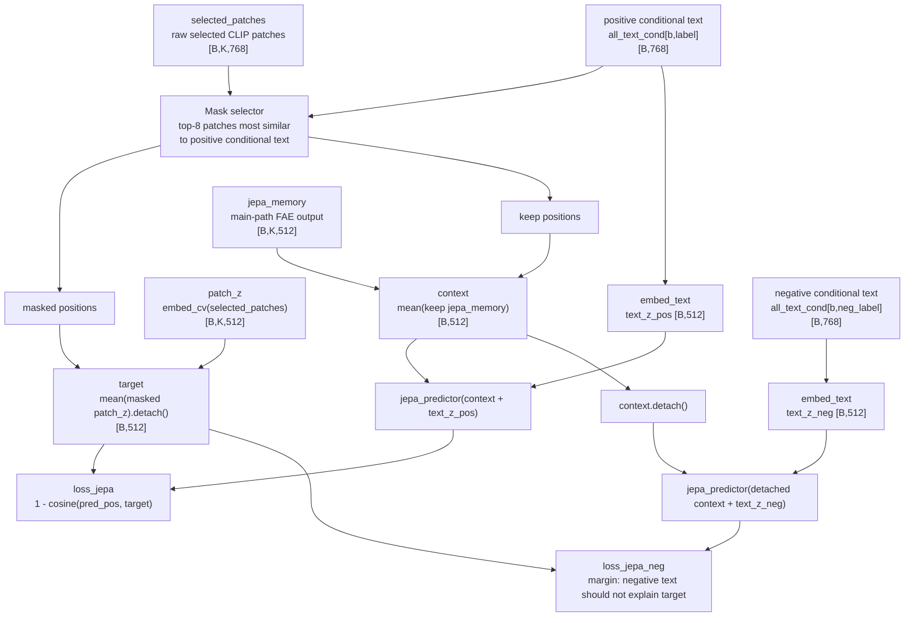
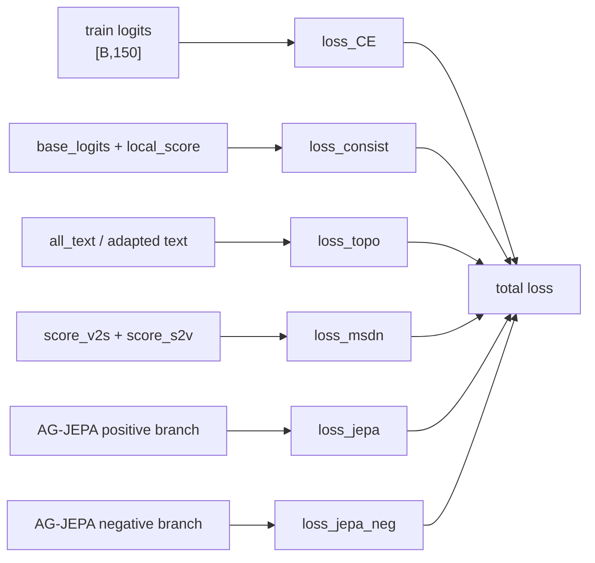

# Framework Diagram: IDEA-0002 / TRIAL-002

```text
trial_id: TRIAL-002
idea_id: IDEA-0002
base_version: v2
code_path: strict main-path FAE memory + conditional AG-JEPA text
html_view: file:///D:/Backup/Documents/Myself/GTPJ_Warehouse/diagrams/IDEA-0002_fae_memory_jepa_code_vs_intent.html
html_sha256: fa963253389f1dec16d0c08719bdc32d105e63342c96e866ecc25df966552892
html_size_bytes: 10771
code_vs_intent: TRIAL-002 uses main forward jepa_memory for AG-JEPA context. TRIAL-001 keep-only FAE recomputation is the comparison boundary.
```

## Shape Legend

```text
B = batch size / number of images
K = selected patch count, 32 when lastvit_select_k=32
C = class count, 200 on CUB
D_clip = CLIP feature dimension, 768
D = transformer hidden dimension, 512
```

## 1. Main Forward Path



## 2. AG-JEPA Loss Path

This path runs only in training loss. It does not replace the classifier.



Key point: current `jepa_context_mode=fae_main_memory` does not call `_ag_jepa_fae_context()`. The positive visual context is mean-pooled from the main `CrossModalTransformer.forward()` FAE memory.

## 3. Loss Attachments



## Variable Glossary

| Variable | Produced by | Consumed by | Shape | Meaning | Gradient boundary | Train/eval difference |
|---|---|---|---|---|---|---|
| `clip_features` | `train_GTPJ_CUB.py` cache loader | `GTPJ.forward` | `[B,577,768]` | one CLS token plus 576 CLIP patch tokens | CLIP is frozen; model receives features | train/eval both use CLS + patches when cache exists |
| `cls_token` | `GTPJ.forward` split | `base_logits`, `meta_net` | `[B,768]` | global CLIP image feature | trains only downstream model parameters | eval also uses it |
| `patches` | `GTPJ.forward` split | `CrossModalTransformer.forward`, AG-JEPA fallback modes | `[B,576,768]` | full CLIP patch grid | CLIP frozen | eval also uses it |
| `selected_patches` | `lastvit_select_patches` | `embed_cv`, mask selector | `[B,K,768]` | top-k raw CLIP patch features | used for mask scoring without gradient through selector | train/eval same selection logic |
| `selected_indices` | `lastvit_select_patches` | `geometry_for_indices` | `[B,K]` | original grid positions of selected patches | no gradient | train/eval same |
| `patch_z` / `vis` | `embed_cv(selected_patches)` | FAE, AG-JEPA target | `[B,K,512]` | projected visual patch representation before FAE | target uses `.detach()` | train/eval produced, loss uses train only |
| `jepa_memory` | main-path `FAE(patch_z, geometry)` | decoders, AG-JEPA context | `[B,K,512]` | FAE-enhanced visual memory from the classifier path | positive JEPA can update FAE; negative context is detached | eval uses it for local score only |
| `all_text` | `_make_all_text()` | base text path, cross-modal decoder | `[C,768]` | class text prototypes after seen CLIP-A-self adapter | adapter trainable for seen classes | train/eval same |
| `all_text_cond` | `meta_net(cls_token)` residual | base logits, conditional AG-JEPA text | `[B,C,768]` | image-conditioned text prototypes | positive/negative text branch updates `meta_net` | only exists when CLS and conditional text are enabled |
| `mask` | `_ag_jepa_loss` top-k selector | target/context split | `[B,K]` | semantic patches to hide and predict | no gradient | train loss only |
| `context` | mean of keep `jepa_memory` | `jepa_predictor` | `[B,512]` | visible FAE-memory context | positive branch trainable; negative branch detaches | train loss only |
| `target` | mean of masked `patch_z` | positive/negative JEPA losses | `[B,512]` | pre-FAE visual target to predict | always detached | train loss only |

## Method Glossary

| Method / module | Code location | Inputs | Outputs | Responsibility | Switches |
|---|---|---|---|---|---|
| `GTPJ.forward` | `model/MyModel.py` | `clip_features`, `is_train` | logits package and JEPA auxiliary tensors | build base logits, local score, and returned tensors for loss | `use_conditional_text`, `score_mode` |
| `CrossModalTransformer.forward` | `model/MyModel.py` | `patches`, `all_text`, `cls_token` | `local_score`, `jepa_patch_z`, `jepa_memory` | select patches, project visual/text tokens, run FAE and v2s/s2v decoders | `use_fae`, LastViT switches |
| `geometry_for_indices` | `model/MyModel.py` | `selected_indices` | relational geometry tensor | align FAE geometry with selected patch positions | `use_fae` |
| `_ag_jepa_loss` | `model/MyModel.py` | returned visual tensors, labels, `all_text_cond` | `loss_jepa`, `loss_jepa_neg` | select semantic mask and train predictor | `use_ag_jepa`, `jepa_context_mode`, `jepa_text_mode` |
| `jepa_predictor` | `model/MyModel.py` | concat of visual context and text condition | predicted target vector | predict hidden visual target from context plus text | `use_ag_jepa` |
| `compute_loss` | `model/MyModel.py` | forward package plus `batch_label` | loss dictionary | attach CE, consistency, topology, MSDN, and AG-JEPA losses | loss weights |

## Code vs Intent

- Current TRIAL-002 config sets `jepa_context_mode: fae_main_memory` and `jepa_text_mode: conditional`.
- This matches the corrected owner intent: AG-JEPA context comes from the main classifier FAE memory, and JEPA text comes from sample-conditioned text.
- Older `jepa_context_mode: fae_memory` remains in code only for TRIAL-001 compatibility; it recomputes keep-only FAE context and is not the current ATTEMPT-009/010 path.
- Logits shape, class order, seen/unseen split, label mapping, and metric calculation are unchanged.
