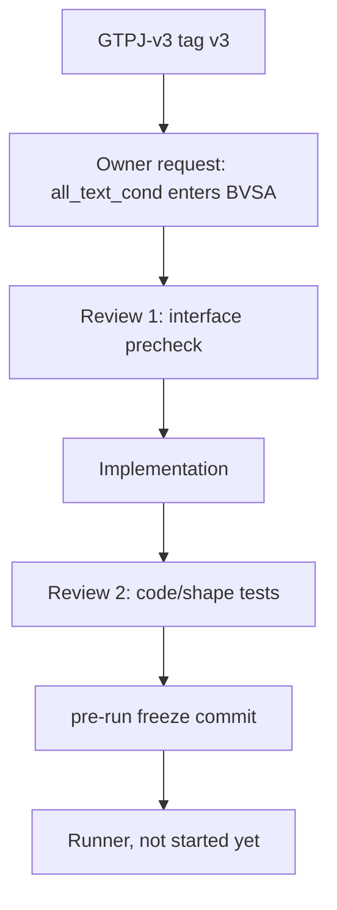

# TRIAL-003_conditional_bvsa_text

```text
trial_id: TRIAL-003
idea_id: IDEA-0002
idea_title: FAE-memory JEPA auxiliary loss
base_version: v3
base_code_tag: v3
branch_source: v3
code_branch: dev/v3-idea-0002-trial-003-conditional-bvsa-text
code_tag:
code_commit:
changed_files: model/MyModel.py; train_GTPJ_CUB.py; config/GTPJ_cub_gzsl.yaml; tests/test_fae_memory_jepa.py
attempts_table: ATTEMPTS.md
best_attempt_id:
best_attempt_dir:
run_config: attempts/ATTEMPT-001/config.yaml
log_artifact_id:
log_uri:
log_sha256:
log_size_bytes:
manifest:
result_yaml:
result_md:
idea_intent_check: idea_intent_check.md
interface_precheck: interface_precheck.md
review_round_1: review_round_1.md
review_round_2:
agent_summary: agent_summary.md
framework_diagram: framework_diagram.md
trial_decision: pending
promote_to:
promotion_decision: not_applicable
evidence_level: code_verified_not_run
best_observed_H:
confirmed_H: pending
confirmation_status: not_run
```

## Motivation

TRIAL-002 makes conditional text reach `base_logits` and AG-JEPA predictor, but BVSA still receives shared adapted class text:

```text
cm_out = cross_tf(patches, all_text, cls_token, ...)
```

TRIAL-003 tests the owner-requested longer chain:

```text
all_text_cond [B, C, 768] -> CrossModalTransformer / BVSA -> local_score [B, C]
```

The intended effect is that `meta_net(cls_token)` directly conditions the BVSA `decoder_v2s / decoder_s2v` text side, not only the global base logits and AG-JEPA loss.

## Changed Files

| File | Change | Code layer |
|---|---|---|
| `model/MyModel.py` | Add `bvsa_text_mode=adapted|conditional`; support BVSA text as `[C,768]` or `[B,C,768]`; pass `all_text_cond` when enabled. | yes |
| `train_GTPJ_CUB.py` | Log `bvsa_text_mode` in the run header. | yes |
| `config/GTPJ_cub_gzsl.yaml` | Branch-local run alias sets `bvsa_text_mode: conditional`. | no |
| `tests/test_fae_memory_jepa.py` | Add gradient/shape tests proving conditional BVSA text reaches `local_score` and `meta_net`. | no |
| `config/versions/v3.yaml` | Unchanged frozen v3 baseline config. | no |

## Attempts

Detailed attempt records live in `ATTEMPTS.md`.

## Trial Flow



## Framework Diagram

```text
path: framework_diagram.md
html_view:
warehouse_artifact:
code_vs_intent: implemented path matches owner intent for BVSA text input; training result is not available yet.
```

## Current Decision

`code_verified_not_run`.

The code path is implemented and locally tested, but no training has been run and no result should be compared against v3 yet.
