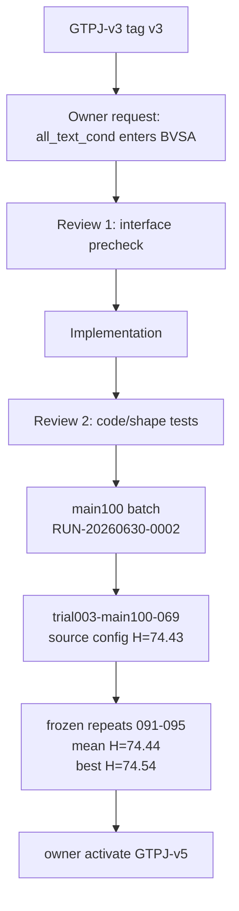

# TRIAL-003_conditional_bvsa_text

```text
trial_id: TRIAL-003
idea_id: IDEA-0002
idea_title: Semantic-Guided Masked Prediction with conditional BVSA text
base_version: v3
base_code_tag: v3
branch_source: v3
code_branch: dev/v3-idea-0002-trial-003-conditional-bvsa-text
code_tag: v5
code_commit: 4b259379d99c1a791442ea9e2fac0bb22b2411a9
changed_files: model/MyModel.py; train_GTPJ_CUB.py; config/GTPJ_cub_gzsl.yaml; tests/test_fae_memory_jepa.py
attempts_table: ATTEMPTS.md
best_attempt_id: trial003-main100-095
best_attempt_dir: warehouse://gtpj/runs/v3/module_trial/TRIAL-003_conditional_bvsa_text/main100/trial003-main100-095
run_config: config.yaml plus main100 generated configs
log_artifact_id: summary:v3:module_trial:TRIAL-003:main100
log_uri: warehouse://gtpj/runs/v3/module_trial/TRIAL-003_conditional_bvsa_text/main100/summary.csv
log_sha256: 3d4c6d6fb413b278527fcc483063051030d4f214761c13214e9f76264c0bc8c8
log_size_bytes: 48505
manifest: ../../../v5/baseline/manifest.yaml
result_yaml: result.yaml
result_md: result.md
idea_intent_check: idea_intent_check.md
interface_precheck: interface_precheck.md
review_round_1: review_round_1.md
review_round_2: tests/test_fae_memory_jepa.py
agent_summary: agent_summary.md
framework_diagram: framework_diagram.md
trial_decision: owner_activated_to_v5
promote_to: v5
promotion_decision: blocked
owner_activation_decision: owner_activate
evidence_level: confirmation_grade
best_observed_H: 74.54
confirmed_H: 74.44
confirmation_status: owner_activated_provisional
```

## Motivation

TRIAL-002 makes conditional text reach `S_global` and the SGMP predictor, but BVSA still receives shared adapted class text:

```text
bvsa_out = bvsa(patches, all_text, cls_token, ...)
```

TRIAL-003 tests the owner-requested longer chain:

```text
all_text_cond [B, C, 768] -> BVSA -> S_local [B, C]
```

The intended effect is that the Image-Conditioned Semantic Adapter (`image_conditioned_semantic_adapter(cls_token)` / ICSA) directly conditions the BVSA `decoder_v2s / decoder_s2v` text side, not only `S_global` and SGMP.

## Changed Files

| File | Change | Code layer |
|---|---|---|
| `model/MyModel.py` | Add framework-name modules/aliases: PSE, ICSA, FGVD, SGMP, BVSA; keep legacy config aliases; pass `all_text_cond` into BVSA when enabled. | yes |
| `train_GTPJ_CUB.py` | Log `FGVD`, `SGMP`, `L_mpp`, `L_neg`, and `L_BMDD` names in the run header/step log. | yes |
| `config/GTPJ_cub_gzsl.yaml` | Branch-local run alias sets `bvsa_text_mode: conditional` plus framework-name config aliases. | no |
| `tests/test_fae_memory_jepa.py` | Add/keep gradient and shape tests proving conditional BVSA text reaches `S_local` and ICSA. | no |
| `config/versions/v3.yaml` | Unchanged frozen v3 baseline config. | no |

## Attempts

Detailed attempt records live in `ATTEMPTS.md`.

## Trial Flow



## Framework Diagram

```text
path: framework_diagram.md
html_view:
warehouse_artifact:
code_vs_intent: implemented path matches owner intent for BVSA text input; training result is not available yet.
```

## Current Decision

`owner_activated_to_v5`.

The code path is implemented, locally tested, and externally run in `RUN-20260630-0002-trial003-main100-2gpu`. The owner selected the best conditional BVSA text candidate as the new active mainline `GTPJ-v5`. Because the frozen-repeat mean is `H=74.44`, `GTPJ-v4 confirmed_H=74.45` remains the stronger confirmed reference.
