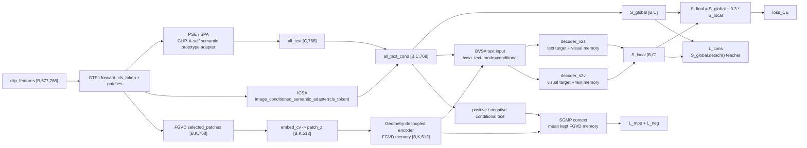

# Framework Diagram: IDEA-0002 / TRIAL-003

```text
trial_id: TRIAL-003
idea_id: IDEA-0002
base_version: v3
code_path: conditional BVSA text input
code_vs_intent: all_text_cond is now the direct BVSA text input when bvsa_text_mode=conditional; code names follow the owner framework diagram.
```

## Shape Legend

```text
B = batch size / number of images
K = selected patch count, 32 when fgvd_select_k=32
C = class count, 200 on CUB
D_clip = CLIP feature dimension, 768
D = transformer hidden dimension, 512
```

## Main Forward And Loss Flow



## Variable Glossary

| Variable | Produced by | Consumed by | Shape | Meaning | Gradient boundary | Train/eval difference |
|---|---|---|---|---|---|---|
| `all_text` | `_make_all_text` | baseline-off BVSA path, conditional text construction | `[C,768]` where `C` is class count | Shared CLIP-A-self adapted class prototypes | gradients reach text adapter where enabled | same train/eval |
| `all_text_cond` | `all_text + icsa_ratio * ICSA(cls_token)` for seen classes | `S_global`, SGMP text, and BVSA when `bvsa_text_mode=conditional` | `[B,C,768]` where `B` is batch size | Per-image conditional class prototypes | gradients reach ICSA and text adapter | requires CLS token |
| `txt_batch` | `BVSA.embed_text(text)` | `decoder_v2s`, `decoder_s2v`, local score | `[B,C,512]` in conditional mode | BVSA text memory/target for each image | no detach | same shape in train/eval if CLS exists |
| `S_local` / `local_score` | BVSA decoders | final fusion, consistency loss | `[B,C]` | Local visual-semantic class score | gradients reach BVSA, FGVD, and conditional text path | train slices seen logits after fusion |
| `S_global` / `base_logits` | cosine of visual CLS and `all_text_cond` | final fusion, consistency teacher | `[B,C]` | Global class score | detached inside `L_cons` teacher path | same train/eval before seen slicing |
| `S_final` / `logits_200` | `S_global + local_weight * S_local` | CE and evaluation | `[B,C]` | Final class score | normal supervised gradient | train returns seen slice |
| `L_mpp` / `loss_mpp` | SGMP | total loss | scalar | Masked Patch Prediction Loss | target detached | train only |
| `L_neg` / `loss_neg` | SGMP | total loss | scalar | Negative Semantic Suppression Loss | visual context detached in negative branch | train only |

## Method Glossary

| Method/module | Code location | Input | Output | Responsibility | Switch |
|---|---|---|---|---|---|
| `GTPJ.forward` | `model/MyModel.py` | `clip_features` | logits package | Builds class text, chooses BVSA text, fuses scores | `bvsa_text_mode` |
| `BidirectionalVisualSemanticAlignment.forward` | `model/MyModel.py` | patches plus text `[C,768]` or `[B,C,768]` | `S_local`, `score_v2s`, `score_s2v`, SGMP tensors | Computes BVSA local branch | input shape driven by `bvsa_text_mode` |
| `decoder_v2s` | `BVSA` | text target, visual memory | class-wise text-aligned features | Visual-to-semantic branch | always on |
| `decoder_s2v` | `BVSA` | visual target, text memory | patch-wise visual-aligned features | Semantic-to-visual branch | always on |
| `fgvd_select_patches` | `model/MyModel.py` | CLIP patch tokens | selected patch indices | Frequency-guided patch selection | `fgvd_select_k` |
| `_semantic_guided_masked_prediction_loss` | `model/MyModel.py` | FGVD memory, patch_z, conditional text | `loss_mpp`, `loss_neg` | SGMP auxiliary training | `use_sgmp`, `lambda_mpp`, `lambda_neg` |

## Baseline-Off Behavior

```text
bvsa_text_mode=adapted -> old v3 behavior:
  BVSA receives all_text [C,768].

bvsa_text_mode=conditional -> TRIAL-003 behavior:
  BVSA receives all_text_cond [B,C,768].
```
