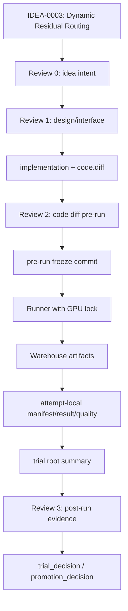

# TRIAL-001_dynamic-routing

```text
trial_id: TRIAL-001
idea_id: IDEA-0003
base_version: v5
base_code_tag: v5
branch_source: main
idea_source_file: idea_tree/ideas/IDEA-0003_dynamic_residual_routing/IDEA.md
idea_title: Dynamic Residual Routing
version_score: 82.0
applicability: direct
code_branch: dev/v5-idea-0003-trial-001-dynamic-routing
code_tag: trial/v5/idea-0003/trial-001
code_commit: pending final freeze commit
trial_decision: pre_run_allowed
promotion_decision: not_applicable
promote_to:
evidence_level: pre_run
best_observed_H:
confirmed_H:
confirmation_status: pending
changed_files: model/MyModel.py; train_GTPJ_CUB.py; workflow/gtpj_workflow.py; tests/test_fae_memory_jepa.py; tests/test_gtpj_workflow.py; trial ledger/config
run_config: config.yaml
log_artifact_id:
log_uri:
log_sha256:
log_size_bytes:
manifest: manifest.yaml
result_yaml: result.yaml
result_md: result.md
idea_intent_check: idea_intent_check.md
interface_precheck: interface_precheck.md
review_round_1: review_round_1.md
review_round_2: review_round_2.md
agent_summary: agent_summary.md
framework_diagram: framework_diagram.md
```

## 改动文件

| 文件 | 改动 | 是否属于代码层 |
|---|---|---|
| `model/MyModel.py` | Add DynamicRoutingGate, dynamic local/ICSA/direction/PSE routes, gate stats, anchor loss. | yes |
| `train_GTPJ_CUB.py` | Log dynamic route mean/std/min/max in epoch train summaries. | yes |
| `workflow/gtpj_workflow.py` | Add 50-job batch planner, status/analyze commands, two-GPU runner with Warehouse copy and failure isolation. | yes |
| `tests/test_fae_memory_jepa.py` | Add dynamic routing fixed/sample/class/backward tests. | yes |
| `tests/test_gtpj_workflow.py` | Add balanced-aggressive plan and runner-guard tests. | yes |
| `experiments/module_trials/IDEA-0003_dynamic_residual_routing/TRIAL-001_dynamic-routing/*` | Trial ledger, config, Review 0-2 evidence, and code diff. | no |

## 结果

| 数据集 | Seed | U | S | H | ZS | Best epoch | Log |
|---|---:|---:|---:|---:|---:|---:|---|

## Trial Flow



## Framework Diagram

```text
path: framework_diagram.md
html_view:
warehouse_artifact:
code_vs_intent: pending
```

`framework_diagram.md` must explain every diagram variable and method:

- variable glossary: source, shape, meaning, gradient/detach status, and train/eval difference.
- method glossary: code location, inputs, outputs, responsibility, config switch, and baseline-off behavior.
- embedded loss flow: each loss is attached to the tensors it reads.
- code vs intent: whether inspected code matches the idea/design.

## Innovation Code Review

```text
Review 0: idea_intent_check.md
Review 1: interface_precheck.md
Review 2: review_round_1.md + interface_check.md + quality_check.md
Review 3: review_round_2.md + agent_summary.md
activation_mode: real_multi_agent
```

## Promotion Gate

- [ ] baseline H、trial H、delta H 已记录。
- [ ] `evidence_level: baseline_grade`；单次最高 H 只能写 `best_observed_H`。
- [ ] clean confirmation 或多 run 稳定性证据明确，`confirmed_H` 和 `confirmation_status` 已记录。
- [ ] U/S/ZS 没有不可接受退化。
- [ ] class order、split、logits shape、metric calculation 未改变。
- [ ] switch off 能回到 `v5` 行为。
- [ ] 证据目录、外部 artifact 指针和 code.diff 完整。
- [ ] `promotion_decision` 为 `promote` 后才允许进入自动 promotion gate。

## 决策

Pre-run implementation is allowed after Review 2. Server batch and Review 3 remain pending; no promotion or v6 creation in this branch.
