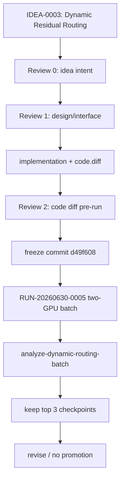

# TRIAL-001_dynamic-routing

```text
trial_id: TRIAL-001
idea_id: IDEA-0003
base_version: v5
base_code_tag: v5
branch_source: main
idea_source_file: idea_tree/ideas/IDEA-0003_dynamic_residual_routing/IDEA.md
idea_title: Dynamic Residual Routing
version_score: 82.0
applicability: direct
code_branch: dev/v5-idea-0003-trial-001-dynamic-routing
run_code_commit: d49f60849b498a0aa6539bb245a2389ffabf2941
trial_decision: revise
promotion_decision: rejected
promote_to:
evidence_level: valid_single_batch
best_observed_H: 74.40
best_dynamic_single_H: 74.39
best_dynamic_repeat_mean_H: 74.23
confirmed_H:
confirmation_status: not_promoted
changed_files: model/MyModel.py; train_GTPJ_CUB.py; workflow/gtpj_workflow.py; tests/test_fae_memory_jepa.py; tests/test_gtpj_workflow.py; trial ledger/config
run_config: config.yaml
attempts: ATTEMPTS.md
manifest: manifest.yaml
result_yaml: result.yaml
result_md: result.md
quality_check: quality_check.md
agent_summary: agent_summary.md
implementation: implementation.md
```

## Run Summary

| Field | Value |
|---|---|
| Server run | `RUN-20260630-0005-dynroute50-2gpu` |
| Runtime path | `/data/lby/projects/cv_project/GTPJ/.gtpj_runtime/batches/RUN-20260630-0005-dynroute50-2gpu` |
| Warehouse summary path | `/data/lby/projects/cv_project/GTPJ_Warehouse/runs/v5/module_trial/TRIAL-001/batch-RUN-20260630-0005-dynroute50-2gpu` |
| Jobs | 50 completed / 0 failed |
| GPU plan | two controllers on GPU0/GPU1 |
| Batch profile | `balanced-aggressive` |
| Analysis command | `python workflow/gtpj_workflow.py analyze-dynamic-routing-batch --run-dir %TEMP%/gtpj-RUN-20260630-0005-dynroute50-2gpu --top-k 12` |

## Dynamic Routes Tested

TRIAL-001 implemented and tested dynamic gates at these v5 routing sites:

| Gate | v5 anchor | Tested modes | Route responsibility |
|---|---:|---|---|
| `local_gate` | 0.2 | fixed, sample, class | final blend between global score and BVSA local score |
| `icsa_gate` | 0.008 | fixed, sample, class | image-conditioned text injection strength |
| `direction_gate` | 0.5 | fixed, sample, class | S2V/V2S BVSA direction mixture |
| `pse_gate` | 0.65 | fixed, class | PSE outer residual strength for seen text prototypes |

## Results

Reference baselines:

| Reference | H | Note |
|---|---:|---|
| v3 CONFIRM-001 confirmed config | 74.47 | stronger confirmed reference |
| v5 repeat mean | 74.44 | active mainline repeat mean |

Top results from this batch:

| Rank | Job | Group | Name | H | U | S | ZS | Best epoch |
|---:|---|---|---|---:|---:|---:|---:|---:|
| 1 | DR-001 | sanity_control | static_v5_control | 74.40 | 71.70 | 77.31 | 81.38 | 45 |
| 2 | DR-008 | local_gate | local_class_h24 | 74.39 | 67.94 | 82.20 | 81.27 | 26 |
| 3 | DR-023 | direction_gate | direction_sample_h48_a0.003 | 74.38 | 72.26 | 76.63 | 81.61 | 48 |
| 4 | DR-041 | top2_frozen_repeat | top1_repeat_1 | 74.37 | 71.76 | 77.17 | 81.62 | 34 |
| 5 | DR-042 | top2_frozen_repeat | top1_repeat_2 | 74.36 | 72.27 | 76.57 | 81.22 | 33 |

Repeat means:

| Source | Repeats | H mean | U mean | S mean | Decision |
|---|---:|---:|---:|---:|---|
| DR-001 static control | 5 | 74.34 | 71.83 | 77.02 | below v4/v5 references |
| DR-008 local_class_h24 | 5 | 74.23 | 68.54 | 80.97 | below v4/v5 references; U weak |

Group summary:

| Group | n | Mean H | Best H | Interpretation |
|---|---:|---:|---:|---|
| `direction_gate` | 6 | 74.10 | 74.38 | best follow-up direction; strong U balance |
| `local_gate` | 8 | 73.60 | 74.39 | close single-run result but repeat mean did not hold |
| `pse_gate` | 6 | 73.61 | 73.86 | stable but not competitive |
| `icsa_gate` | 8 | 53.64 | 62.88 | collapsed or over-injected; avoid dynamic ICSA for now |
| `combination` | 8 | 57.32 | 73.38 | combinations are too unstable in this profile |

## Decision

`promotion_decision: rejected`.

The best dynamic single result, DR-008 at H=74.39, did not beat `v3/CONFIRM-001 local-v3-054` confirmed H=74.47 or v5 repeat mean H=74.44. The repeated dynamic candidate averaged H=74.23 and had a low U mean. The static control also did not exceed references.

`trial_decision: revise`.

Follow-up work should keep ICSA fixed, prioritize direction/local/PSE gates, and use the `principled-followup` batch profile that was added after this run.

## Follow-Up Attempt Status

ATTEMPT-002 tested a deliberate `batch_size=128` intervention with two 50-job
workflow batches:

| Attempt | Runs | Status | Best H | Decision |
|---|---|---|---:|---|
| `ATTEMPT-002` | `RUN-20260701-0007-dynroute-bs128-exploit50-2gpu` + `RUN-20260701-0008-dynroute-bs128-bold50-2gpu` | 94 completed / 6 failed | 70.84 | reject, restore future bs=64 |

This follow-up is negative batch-size evidence, not promotion evidence. The bs=128
static control reached only H=69.70, far below the bs=64 control region, so future
dynamic routing batches are locked back to `batch_size=64` unless the owner
explicitly reopens batch-size ablation.

ATTEMPT-002 summary artifacts:

- `runtime:v5:module_trial:TRIAL-001:RUN-20260701-0007:summary` -> `lab4090:/data/lby/projects/cv_project/GTPJ/.gtpj_runtime/batches/RUN-20260701-0007-dynroute-bs128-exploit50-2gpu/summary.csv`
- `runtime:v5:module_trial:TRIAL-001:RUN-20260701-0008:summary` -> `lab4090:/data/lby/projects/cv_project/GTPJ/.gtpj_runtime/batches/RUN-20260701-0008-dynroute-bs128-bold50-2gpu/summary.csv`

## Checkpoint Retention

The server Warehouse was pruned according to the workflow rule "keep only the best 3 model checkpoints after each experiment batch." The retained checkpoints are:

| Job | H | Path |
|---|---:|---|
| DR-001 | 74.40 | `attempt-001/logs/best_model_CUB_2026-06-30_16-11-11_H7440.pth` |
| DR-008 | 74.39 | `attempt-008/logs/best_model_CUB_2026-06-30_16-38-54_H7439.pth` |
| DR-023 | 74.38 | `attempt-023/logs/best_model_CUB_2026-06-30_18-01-09_H7438.pth` |

97 lower-ranked model checkpoint files were deleted from the Warehouse attempt logs. Metrics, logs, configs, summaries, and manifests were retained.

## Evidence Files

- `ATTEMPTS.md`
- `attempts/ATTEMPT-001/manifest.yaml`
- `attempts/ATTEMPT-001/result.yaml`
- `attempts/ATTEMPT-001/result.md`
- `attempts/ATTEMPT-001/quality_check.md`
- `attempts/ATTEMPT-002/manifest.yaml`
- `attempts/ATTEMPT-002/result.yaml`
- `attempts/ATTEMPT-002/result.md`
- `attempts/ATTEMPT-002/quality_check.md`
- `attempts/ATTEMPT-002/agent_summary.md`
- `manifest.yaml`
- `result.yaml`
- `result.md`
- `quality_check.md`
- `agent_summary.md`

## Trial Flow


