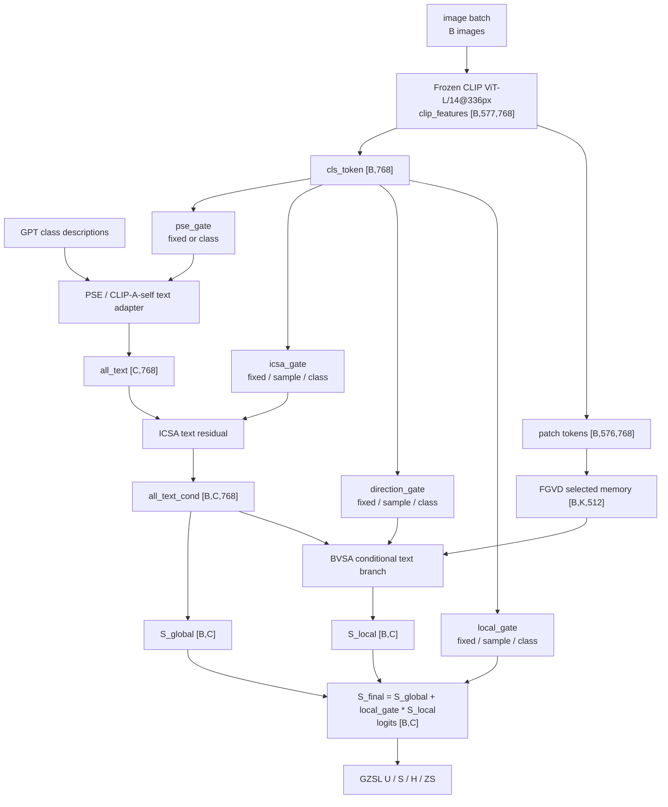

# Framework Diagram: IDEA-0003 / TRIAL-001

```text
trial_id: TRIAL-001
idea_id: IDEA-0003
base_version: v5
code_path: Dynamic Residual Routing
run_code_commit: d49f60849b498a0aa6539bb245a2389ffabf2941
code_vs_intent: dynamic gates modulate existing residual strengths; GZSL evaluation semantics remain unchanged.
```

## Main Forward Flow



## Variable Glossary

| Variable | Produced by | Consumed by | Shape | Meaning | Gradient boundary | Train/eval difference |
|---|---|---|---|---|---|---|
| `local_gate` | dynamic routing head or fixed anchor | final score fusion | scalar, `[B,1]`, or `[B,C]` depending mode | controls BVSA local score strength | gradients reach the gate if dynamic | same route family train/eval |
| `icsa_gate` | dynamic routing head or fixed anchor | ICSA text residual | scalar, `[B,1]`, or `[B,C]` | controls conditional text injection | gradients reach the gate if dynamic | same route family train/eval |
| `direction_gate` | dynamic routing head or fixed anchor | BVSA direction blend | scalar, `[B,1]`, or `[B,C]` | controls S2V/V2S mixture | gradients reach the gate if dynamic | same route family train/eval |
| `pse_gate` | dynamic routing head or fixed anchor | PSE residual blend | scalar or class-level gate | controls text prototype residual strength | gradients reach the gate if dynamic | same route family train/eval |
| `all_text_cond` | PSE + ICSA after optional gates | global scorer, BVSA, SGMP | `[B,C,768]` | per-image conditional class prototypes | normal gradient | same shape train/eval |
| `S_local` | BVSA | final fusion | `[B,C]` | local class score | normal gradient | train may slice seen classes for CE |
| `S_final` | gated fusion | CE/evaluation | `[B,C]` | final logits | normal gradient | train may slice seen classes for CE |

## Method Glossary

| Method / module | Code location | Inputs | Outputs | Responsibility | Config switch | Baseline-off behavior |
|---|---|---|---|---|---|---|
| Dynamic routing gate heads | `model/MyModel.py` | CLS/image context, optional class text context | gate values | predict sample/class-specific residual strengths | `dynamic_*_mode`, hidden/alpha config | `fixed` mode returns v5 anchor values |
| Local gate route | `model/MyModel.py` | `S_local`, `S_global`, gate | fused logits | controls how much local branch enters final score | `dynamic_local_mode`, `local_weight` anchor | fixed mode equals v5 `local_weight=0.2` |
| ICSA gate route | `model/MyModel.py` | CLS token, text prototypes, gate | `all_text_cond` | controls image-conditioned semantic injection | `dynamic_icsa_mode`, `icsa_ratio` anchor | fixed mode equals v5 `icsa_ratio=0.008` |
| Direction gate route | `model/MyModel.py` | BVSA branch scores and gate | local score blend | controls S2V/V2S contribution | `dynamic_direction_mode`, `weight_s2v` anchor | fixed mode equals v5 direction anchor |
| PSE gate route | `model/MyModel.py` | raw/adapted text prototypes and gate | `all_text` | controls text prototype residual strength | `dynamic_pse_mode`, `pse_outer_ratio` anchor | fixed mode equals v5 `pse_outer_ratio=0.65` |

## Loss Flow

No new loss is the core contribution of TRIAL-001. Existing CE, consistency, and SGMP losses read the gated forward tensors. If a gate changes logits or auxiliary inputs, its effect must be visible through those existing losses rather than through a new objective.

## Code vs Intent

The first-principles intent is dynamic residual routing:

```text
increase a residual when the sample/class needs that information;
decrease it when the residual risks over-injection, seen bias, or unstable local evidence.
```

The first 50-job batch showed that dynamic ICSA is risky and that local/direction routes are safer follow-up directions. The trial decision remains `revise`, not promote.

## GZSL Boundary

```text
seen/unseen split: unchanged
class order: unchanged
label mapping: unchanged
metric semantics: unchanged
logits shape: [B (image/sample count), C (class count)]
baseline-off: all dynamic gates fixed to v5 anchors should reproduce the static v5 path.
```
