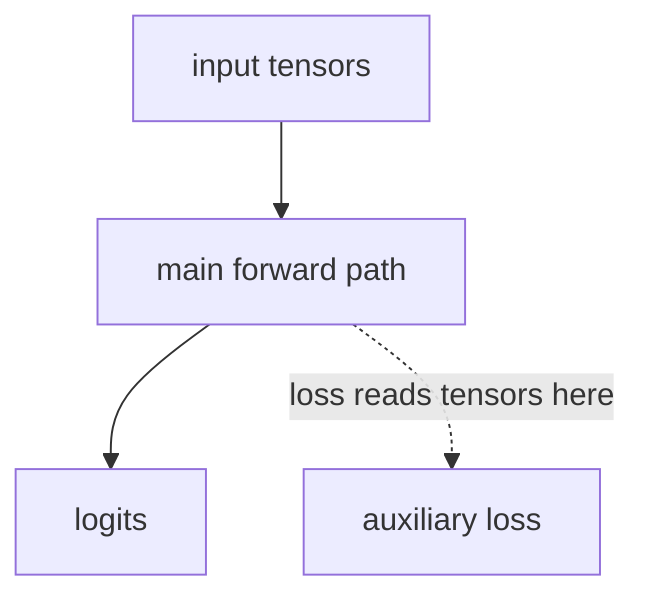

# Framework Diagram

```text
trial_id: TRIAL-001
idea_id: IDEA-0003
base_version: v5
source_idea_file: idea_tree/ideas/IDEA-0003_dynamic_residual_routing/IDEA.md
html_view:
warehouse_artifact:
code_vs_intent: pending
```

## Diagram

Add the authoritative Mermaid diagram here. If an HTML view is generated for owner review,
record its local `file:///D:/...` link or Warehouse artifact above.



## Variable Glossary

| Variable | Produced by | Consumed by | Shape | Meaning | Grad / detach | Train/eval difference |
|---|---|---|---|---|---|---|

## Method Glossary

| Method / module | Code location | Inputs | Outputs | Responsibility | Config switch | Baseline-off behavior |
|---|---|---|---|---|---|---|

## Loss Flow

| Loss | Reads | Target / teacher / source | Weight key | Gradient boundary | Where it appears in the diagram |
|---|---|---|---|---|---|

## Code vs Intent

- [ ] The diagram is grounded in inspected code, not memory.
- [ ] The implemented path matches the idea/design.
- [ ] Any mismatch is explicitly marked as code vs intent.
- [ ] Lines do not overlap nodes or other semantic lines in the owner HTML view.
