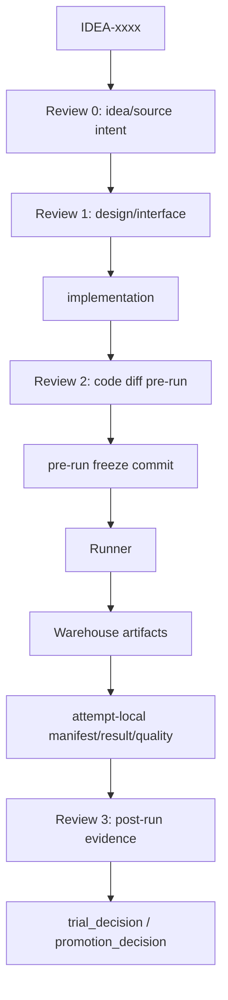

# TRIAL

```text
trial_id:
idea_id:
idea_title:
base_version:
base_code_tag:
branch_source: main
code_branch: dev/v1-idea-xxxx-trial-001-short-name
code_tag: trial/v1/idea-xxxx/trial-001
code_commit:
changed_files:
attempts_table: ATTEMPTS.md
best_attempt_id:
best_attempt_dir:
run_config:
log_artifact_id:
log_uri:
log_sha256:
log_size_bytes:
manifest:
result_yaml:
result_md:
idea_intent_check: idea_intent_check.md
interface_precheck: interface_precheck.md
review_round_1: review_round_1.md
review_round_2: review_round_2.md
agent_summary: agent_summary.md
framework_diagram: framework_diagram.md
trial_decision:
promote_to:
promotion_decision:
evidence_level:
best_observed_H:
confirmed_H:
confirmation_status:
```

`code_branch` is cut from current `main`. `base_code_tag` is the true code source.

## Changed Files

| File | Change | Code layer |
|---|---|---|

## Result

| Attempt ID | Dataset | Seed | U | S | H | ZS | Best epoch | Log artifact |
|---|---|---:|---:|---:|---:|---:|---:|---|

## Attempts

Detailed attempt records live in `ATTEMPTS.md`. Reproducibility evidence for each attempt should live in `attempts/ATTEMPT-xxx/`, unless this is a legacy single-attempt trial.

## Trial Flow



## Framework Diagram

```text
path: framework_diagram.md
html_view:
warehouse_artifact:
code_vs_intent:
```

`framework_diagram.md` must include:

- variable glossary: every diagram variable's source, shape, meaning, gradient/detach status, and train/eval difference.
- method glossary: every diagram method/module's code location, inputs, outputs, responsibility, config switch, and baseline-off behavior.
- embedded loss flow: each loss is attached to the tensors it reads; do not list all losses only at the end.
- line semantics: each arrow says whether it is data flow, supervision/target, read-only reference, or config/control.
- code vs intent note: explicitly state whether the implemented path matches the idea/design.

## Innovation Code Review

```text
Review 0: idea_intent_check.md
Review 1: interface_precheck.md
Review 2: review_round_1.md + interface_check.md + quality_check.md
Review 3: review_round_2.md + agent_summary.md
activation_mode: real_multi_agent
```

## Promotion Gate

Fill only when `trial_decision: promote`:

```text
parent_version:
parent_tag:
baseline_H:
trial_H:
delta_H:
same_seed_control:
multi_seed_required:
evidence_level: baseline_grade
best_observed_H:
confirmed_H:
confirmation_status: confirmed
config_snapshot:
log_artifact_id:
log_uri:
log_sha256:
eval_contract_changed: yes/no
switch_off_equivalent: yes/no
version_tree_updated: yes/no
promotion_decision: PENDING
```
