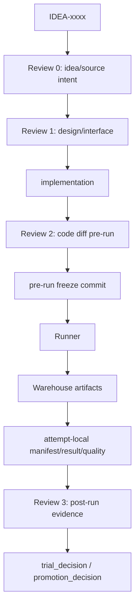
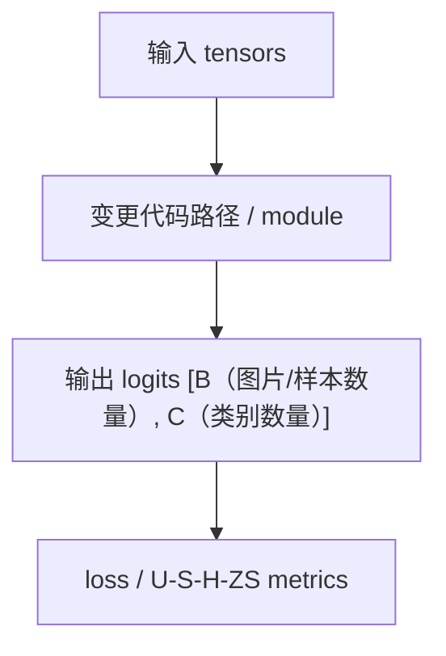

# TRIAL（历史兼容模板，禁止用于新实验）

新实验请使用 `experiment_README_template.md`，并登记到目标框架的四类账本。本模板只用于补齐旧 Trial 证据。

```text
trial_id:
idea_id:
idea_title:
base_version:
base_code_tag:
branch_source: legacy_preserved
code_branch: historical_dev_branch_only
code_tag: trial/v1/idea-xxxx/trial-001
code_commit:
changed_files:
module_source: module_source.md
trial_meta: trial_meta.yaml
module_template_family:
module_scope:
composition_mode:
standard_gzsl_framework: experiments/templates/modules/standard_gzsl_module_framework_template.py
standard_gzsl_training_template: experiments/templates/modules/standard_gzsl_training_template.py
training_entry_mode: existing_entry_equivalent | strict_template_entry
selected_training_entry:
legacy_module_migration: not_required | required | completed
attempts_table: ATTEMPTS.md
best_attempt_id:
best_attempt_dir:
run_config:
log_artifact_id:
log_uri:
log_sha256:
log_size_bytes:
manifest:
result_yaml:
result_md:
idea_intent_check: idea_intent_check.md
interface_precheck: interface_precheck.md
review_round_1: review_round_1.md
review_round_2: review_round_2.md
agent_summary: agent_summary.md
framework_diagram: framework_diagram.md
trial_decision:
promote_to:
promotion_decision:
evidence_level:
best_observed_H:
confirmed_H:
confirmation_status:
```

`code_branch` 从当前 `main` 切出。`base_code_tag` 是真实代码来源。

## Changed Files（代码变更文件）

| 文件 | 变更 | 代码层 |
|---|---|---|

## Module Source（模块来源）

```text
path: module_source.md
trial_meta: trial_meta.yaml
source_type:
paper_id:
source_ref:
official_code_url:
official_code_path:
mechanism_claim:
template_family:
module_scope:
components:
composition_mode:
affects:
attachment_point:
training_template: experiments/templates/modules/standard_gzsl_training_template.py
training_entry_mode:
selected_training_entry:
legacy_module_migration:
baseline_off_explanation:
paper_writing_note:
```

新的 module trial 不能省略 source 和 template mapping。历史 baselines 可以作为 legacy records 保留。
本 README 记录 trial/root 的方法框架；`attempts/ATTEMPT-xxx/` 只记录同一框架下的配置、运行和结果。

## Result（结果）

| Attempt ID | Dataset | Seed | U | S | H | ZS | Best epoch | Log artifact |
|---|---|---:|---:|---:|---:|---:|---:|---|

## Attempts（尝试记录）

详细 attempt 记录放在 `ATTEMPTS.md`。除非这是 legacy single-attempt trial，否则每个 attempt
的可复现证据应放在 `attempts/ATTEMPT-xxx/`。

## Trial Flow（试验流程）


```mermaid
flowchart TD
  Idea["IDEA-xxxx"] --> Review0["Review 0: idea/source intent"]
  Review0 --> Review1["Review 1: design/interface"]
  Review1 --> Impl["implementation"]
  Impl --> Review2["Review 2: code diff pre-run"]
  Review2 --> Freeze["pre-run freeze commit"]
  Freeze --> Runner["Runner"]
  Runner --> Warehouse["Warehouse artifacts"]
  Warehouse --> Attempt["attempt-local manifest/result/quality"]
  Attempt --> Review3["Review 3: post-run evidence"]
  Review3 --> Decision["trial_decision / promotion_decision"]
```

## Framework Diagram（框架图）

```text
path: framework_diagram.md
html_view:
warehouse_artifact:
code_vs_intent:
```

`framework_diagram.md` 必须包含：

- variable glossary（变量表）：每个图中变量的来源、shape（形状）、含义、gradient/detach 状态和 train/eval 差异。
- method glossary（方法表）：每个图中 method/module 的代码位置、输入、输出、职责、config switch 和 baseline-off behavior。
- embedded loss flow（嵌入式损失流程）：每个 loss 都要贴到它读取的 tensor 上，不能只在末尾列 loss 名。
- line semantics（连线语义）：每条箭头都要说明是 data flow、supervision/target、read-only reference 还是 config/control。
- code vs intent note（代码与意图对照）：显式说明实现路径是否符合 idea/design。

## Code Flow Diagram（代码流程图）

当该 Trial 新增或改写 module、forward、loss、evaluation、data view、input/output、
tensor flow、接口语义或 code branching logic 时必须填写。README 中的图要让 owner
能快速读懂；完整变量和方法细节放在 `framework_diagram.md`。调参、复现、只关闭既有组件的
窄消融不新增本图。


```mermaid
flowchart TD
  Input["输入 tensors"] --> Changed["变更代码路径 / module"]
  Changed --> Output["输出 logits [B（图片/样本数量）, C（类别数量）]"]
  Output --> Metric["loss / U-S-H-ZS metrics"]
```

## Innovation Code Review（创新代码审核）

```text
Review 0: idea_intent_check.md
Review 1: interface_precheck.md
Review 2: review_round_1.md + interface_check.md + quality_check.md
Review 3: review_round_2.md + agent_summary.md
activation_mode: real_multi_agent
ai_cross_review: 重要代码/决策改动必须执行；使用 validate-ai-cross-review 校验
```

## Promotion Gate（升版门槛）

仅当 `trial_decision: promote` 时填写：

```text
parent_version:
parent_tag:
baseline_H:
trial_H:
delta_H:
same_seed_control:
multi_seed_required:
evidence_level: baseline_grade
best_observed_H:
confirmed_H:
confirmation_status: confirmed
config_snapshot:
log_artifact_id:
log_uri:
log_sha256:
eval_contract_changed: yes/no
switch_off_equivalent: yes/no
version_tree_updated: yes/no
promotion_decision: PENDING
```
