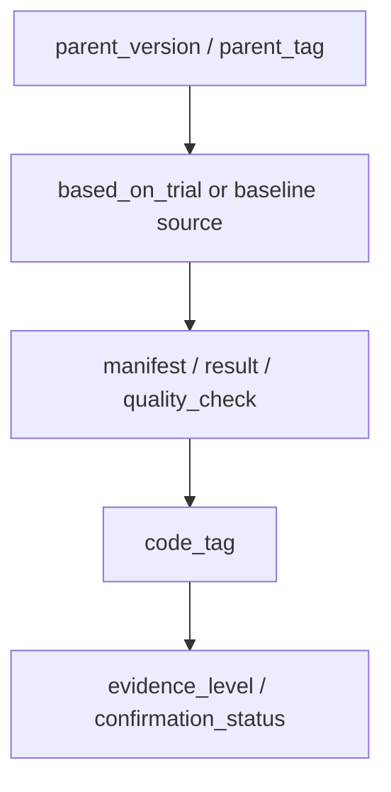

# VERSION

```text
version:
baseline_name:
status:
code_tag:
parent_version:
parent_tag:
change_type:
based_on_trial:
inherits_code_from:
does_not_inherit:
ledger_source:
ledger_source_commit:
code_source:
config:
framework_diagram: experiments/vX/framework_diagram.md
module_glossary: experiments/vX/MODULES.md
```

## 当前启用模块

-

## 相比 Base 的变化

-

## 版本树位置

```text
parent_version:
children:
notes:
```

## Framework Diagram

```text
framework_diagram: framework_diagram.md
module_glossary: MODULES.md
source_trial_framework:
```

`framework_diagram.md` must explain the active version forward path, key tensors, module responsibilities, GZSL hard-rule boundary, loss/training flow, and code-vs-intent notes. `MODULES.md` must explain every named module with purpose, input, output, config switch, and baseline-off behavior.

## Version Flow



## 允许的实验类型

- tune
- ablation
- confirmation
