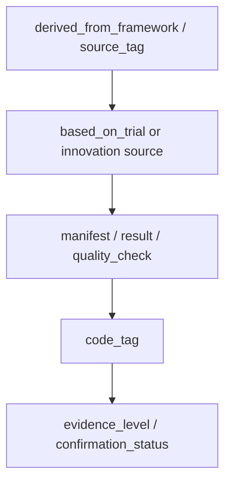

# VERSION（版本记录）

```text
version:
baseline_name:
status:
code_tag:
registry_level: formal_peer
derived_from_framework:
source_tag:
promoted_from_experiment:
change_type:
based_on_trial:
inherits_code_from:
does_not_inherit:
ledger_source:
ledger_source_commit:
code_source:
config:
framework_diagram: experiments/vX/framework_diagram.md
module_glossary: experiments/vX/MODULES.md
```

## 当前启用模块

-

## 相比 Base 的变化

-

## 同级框架注册位置

```text
registry_level: formal_peer
derived_from_framework:
notes:
```

## Framework Diagram（版本框架图）

```text
framework_diagram: framework_diagram.md
module_glossary: MODULES.md
source_trial_framework:
```

`framework_diagram.md` 必须解释当前启用版本的 forward path（前向路径）、关键 tensors（张量）、
module responsibilities（模块职责）、GZSL hard-rule boundary（硬规则边界）、
loss/training flow（损失和训练流程）以及 code-vs-intent notes（代码与设计意图对照）。
`MODULES.md` 必须解释每个命名 module 的 purpose（目的）、input（输入）、output（输出）、
config switch（配置开关）和 baseline-off behavior（关闭后回到基线的行为）。

## Version Flow（版本流转）


```mermaid
flowchart TD
  Source["derived_from_framework / source_tag"] --> Trial["based_on_trial or innovation source"]
  Trial --> Evidence["manifest / result / quality_check"]
  Evidence --> Version["code_tag"]
  Version --> Status["evidence_level / confirmation_status"]
```

## 允许的实验类型

- tune
- ablation
- innovation
- confirmation
