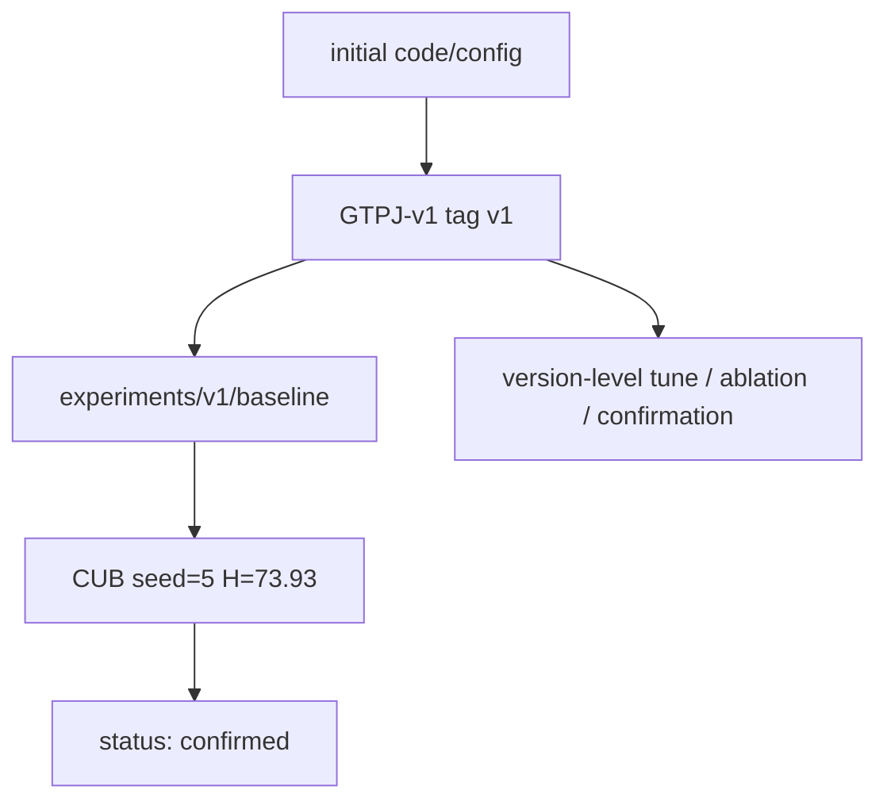

# GTPJ-v1

```text
version: v1
baseline_name: GTPJ-v1
status: confirmed
code_tag: v1
parent_version: none
parent_tag: none
change_type: initial_baseline
based_on_trial: none
inherits_code_from: none
does_not_inherit: none
ledger_source: initial
ledger_source_commit: none
code_source: initial
config: experiments/v1/config.yaml
baseline_evidence: experiments/v1/baseline/
```

## 当前启用模块

- 冻结的 CLIP ViT-L/14@336px backbone
- GPT 文本描述 prototype
- Text Adapter
- Patch bottleneck / patch selection
- 几何感知局部视觉编码
- 双向视觉-文本交互
- 拓扑保持文本约束
- 条件文本适配
- 视觉-文本双分支互蒸馏
- AG-JEPA 辅助训练
- AG-JEPA negative text margin

## 训练策略

- 使用严格连续训练。
- 使用 SGDR 风格的 20+20+10 分阶段 cosine learning rate，并设置非零 `eta_min`。
- 不使用 test metrics 来重启、回滚、停止或改变训练。
- `config.yaml` 只保留启用的 v1 字段。
- 未启用的候选模块属于 `idea_tree/`，不属于 v1 baseline config。
- 第一版正式 GTPJ-v1 CUB seed=5 baseline：`H=73.93`，best epoch=26。

## 版本树位置

```text
parent_version: none
children: none yet
notes: v1 是当前版本树根节点。
```

## Version Flow



## 允许的实验类型

- `tune/`
- `ablation/`
- `confirmation/`
