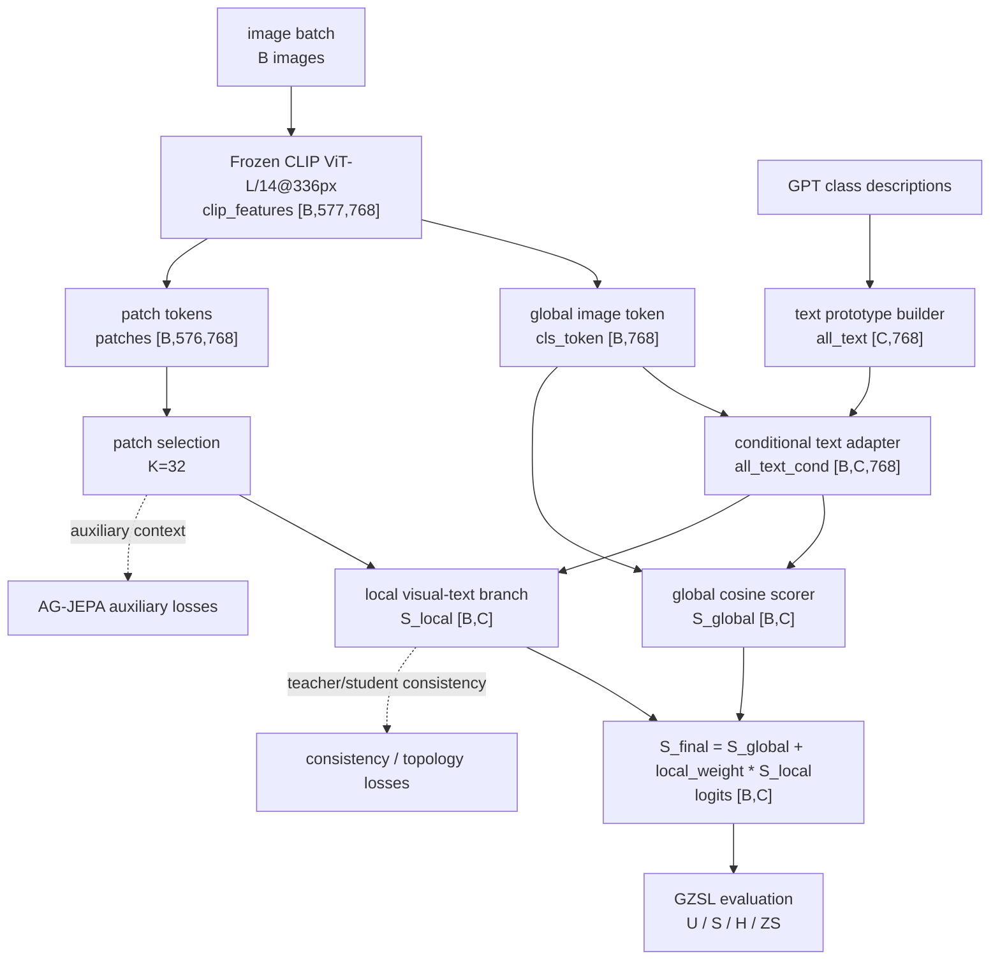

# GTPJ-v1 Framework Diagram

```text
version: v1
config: experiments/v1/config.yaml
module_glossary: MODULES.md
diagram_scope: formal version-level code/config summary
code_vs_intent: summary is grounded in the v1 ledger and archived config; raw training artifacts stay in Warehouse.
```

## Main Forward Flow



## Variable Glossary

| Variable | Source | Shape | Meaning |
|---|---|---|---|
| `B` | dataloader | scalar | image/sample count in the current batch |
| `C` | CUB class set | `200` | class count used by logits and evaluation |
| `clip_features` | frozen CLIP image encoder | `[B,577,768]` | CLS token plus patch tokens |
| `all_text` | GPT text descriptions through CLIP text path | `[C,768]` | class text prototypes |
| `all_text_cond` | conditional text adapter | `[B,C,768]` | image-conditioned class text prototypes |
| `S_global` | global image-text scorer | `[B,C]` | global class score |
| `S_local` | local visual-text branch | `[B,C]` | patch-aware local class score |
| `S_final` / logits | score fusion | `[B,C]` | final class logits; train may slice seen classes for CE |

## Module Glossary

See `MODULES.md` for the authoritative module table. The version-level diagram only shows how the modules connect.

## Loss And Training Flow

The archived v1 config uses a staged learning-rate schedule. `epochs: 30` is a legacy field; the effective schedule is `lr_stages = 20 + 20 + 10`, i.e. 50 planned training epochs.

Auxiliary losses are attached to the local branch and text/patch context. They do not change class order, split semantics, or final logits shape.

## GZSL Hard Rules

```text
seen/unseen split: unchanged
class order: unchanged
label mapping: unchanged
metric semantics: unchanged
logits shape: [B (image/sample count), C (class count)]
unseen label leakage: forbidden
```
