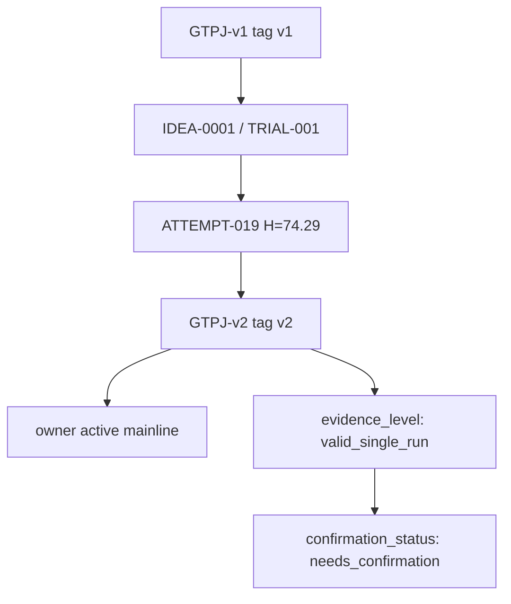

# GTPJ-v2

```text
version: v2
baseline_name: GTPJ-v2
status: owner_activated_unconfirmed
code_tag: v2
parent_version: v1
parent_tag: v1
change_type: add_module
based_on_trial: trial/v1/idea-0001/trial-001
source_trial: experiments/module_trials/IDEA-0001_clip_a_self_text_prototype/TRIAL-001_clip_a_self_residual_seenonly
source_attempt: ATTEMPT-019
source_trial_run_commit: 453acc0
source_attempt_record_commit: 3a7945a
ledger_source: dev/v1-idea-0001-trial-001-clip-a-self-residual-seenonly
ledger_source_commit: f24a277
code_source: v1 + TRIAL-001 CLIP-A-self text prototype adapter
config: experiments/v2/config.yaml
framework_diagram: experiments/v2/framework_diagram.md
module_glossary: experiments/v2/MODULES.md
baseline_evidence: experiments/v2/baseline/
evidence_level: valid_single_run
best_observed_H: 74.29
confirmed_H: pending
confirmation_status: needs_confirmation
active_main_update: activated_by_owner
owner_decision_date: 2026-06-27
```

## 当前启用模块

- 冻结的 CLIP ViT-L/14@336px backbone
- GPT 文本描述 prototype
- CLIP-A-self sentence-level text prototype adapter
- Patch bottleneck / patch selection
- 几何感知局部视觉编码
- 双向视觉-文本交互
- 拓扑保持文本约束
- 条件文本适配
- 视觉-文本双分支互蒸馏
- AG-JEPA 辅助训练
- AG-JEPA negative text margin

## 相对 v1 的变化

`GTPJ-v2` 接纳 `TRIAL-001` 的 CLIP-A-self 文本原型路径作为当前主线：

- 每类 GPT/VDT 文本先保留句级 CLIP text encoder 表征；
- seen 类句向量经过 CLIP-A-self self-attention adapter；
- adapter 输出先用 `clip_a_self_inner_ratio=0.35` 与原句向量做一级残差；
- 句向量平均后，再用 `clip_a_self_outer_ratio=0.15` 与原始 CLIP 句均值做二级残差；
- `clip_a_self_apply_unseen=false`，unseen 文本原型仍走原始句均值路径；
- downstream scoring、class order、seen/unseen split、label mapping、logits shape 和 GZSL metric calculation 不变。

## 训练策略

- CUB seed=5 使用 `experiments/v2/config.yaml`。
- 训练命令继承 ATTEMPT-019：

```bash
conda run --no-capture-output -n dvsr_gpu python train_GTPJ_CUB.py --config experiments/module_trials/IDEA-0001_clip_a_self_text_prototype/TRIAL-001_clip_a_self_residual_seenonly/attempts/ATTEMPT-019/config.yaml
```

- 有效 schedule 仍是三阶段 `20 + 20 + 10`，`epochs: 30` 只是配置中的历史字段，不是实际总轮数上限。

## 结果状态

| Dataset | Seed | U | S | H | ZS | Best epoch | Delta H vs v1 |
|---|---:|---:|---:|---:|---:|---:|---:|
| CUB GZSL | 5 | 71.32 | 77.52 | 74.29 | 81.59 | 33 | +0.36 |

```text
evidence_level: valid_single_run
best_observed_H: 74.29
confirmed_H: pending
confirmation_status: needs_confirmation
```

## 质量说明

`GTPJ-v2` 是 owner 在 2026-06-27 明确要求主线化的当前代码版本。已保留以下风险：

- `ATTEMPT-019` 尚未补充独立 clean confirmation rerun，因此 `H=74.29` 只能作为
  `best_observed_H`，不能写成 `confirmed_H`；
- `S - U = 6.20`，结果偏 seen-heavy；
- 后续论文级结论仍建议补做 v2 confirmation、seen/unseen gap analysis 和关键 ablation。

## 版本树位置

```text
parent_version: v1
children: none yet
notes: v2 是基于 v1 + IDEA-0001/TRIAL-001 的当前 active mainline；证据状态为 owner_activated_unconfirmed。
```

## Framework Diagram

```text
framework_diagram: framework_diagram.md
module_glossary: MODULES.md
source_trial_framework: experiments/module_trials/IDEA-0001_clip_a_self_text_prototype/TRIAL-001_clip_a_self_residual_seenonly/framework_diagram.md
```

The version-level diagram summarizes the activated v2 path. The source trial diagram records the trial-local implementation evidence.

## Version Flow



## 允许的实验类型

- `tune/`
- `ablation/`
- `confirmation/`
