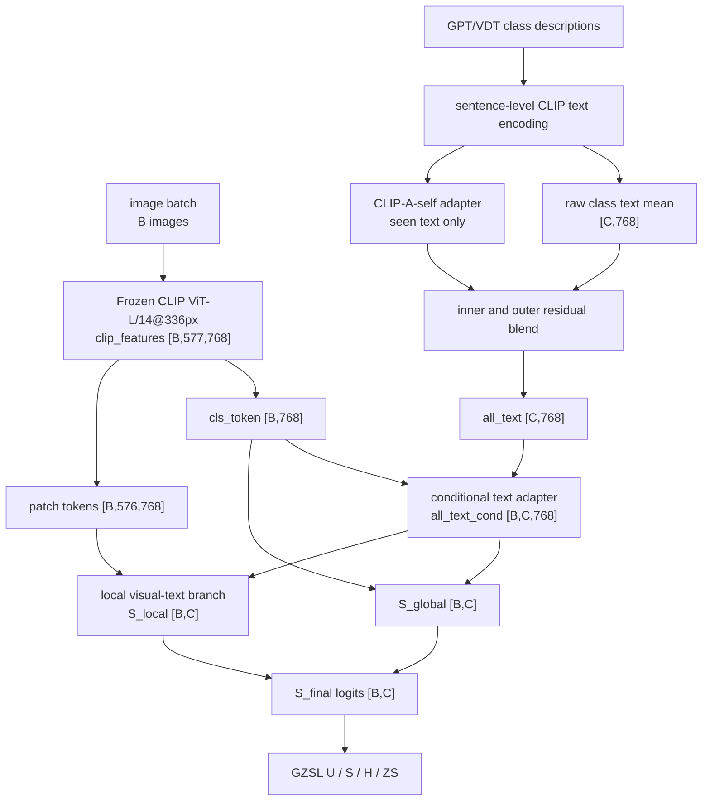

# GTPJ-v2 Framework Diagram

```text
version: v2
parent_version: v1
based_on_trial: experiments/module_trials/IDEA-0001_clip_a_self_text_prototype/TRIAL-001_clip_a_self_residual_seenonly
config: experiments/v2/config.yaml
module_glossary: MODULES.md
code_vs_intent: v2 activates the CLIP-A-self sentence-level text prototype adapter from TRIAL-001.
```

## Main Forward Flow



## Variable Glossary

| Variable | Source | Shape | Meaning |
|---|---|---|---|
| `B` | dataloader | scalar | image/sample count |
| `C` | CUB class set | `200` | class count |
| `sentence_text_features` | CLIP text encoder over GPT/VDT sentences | `[C,N,768]` conceptually | sentence-level text features before class pooling |
| `all_text` | CLIP-A-self adapter and residual blend | `[C,768]` | adapted class text prototypes |
| `all_text_cond` | conditional adapter | `[B,C,768]` | per-image class text prototypes |
| `S_global` | global scorer | `[B,C]` | global logits before local fusion |
| `S_local` | local branch | `[B,C]` | local visual-semantic logits |
| `S_final` | fusion | `[B,C]` | final logits for CE/evaluation |

## Module Glossary

See `MODULES.md`. v2's new code-level contribution is the CLIP-A-self text prototype adapter.

## Loss And Training Flow

The training schedule is controlled by `lr_stages = 20 + 20 + 10`; the historical `epochs: 30` field is not the total run length.

## GZSL Hard Rules

```text
seen/unseen split: unchanged
class order: unchanged
label mapping: unchanged
metric semantics: unchanged
logits shape: [B (image/sample count), C (class count)]
unseen label leakage: forbidden; CLIP-A-self is configured with clip_a_self_apply_unseen=false.
```
