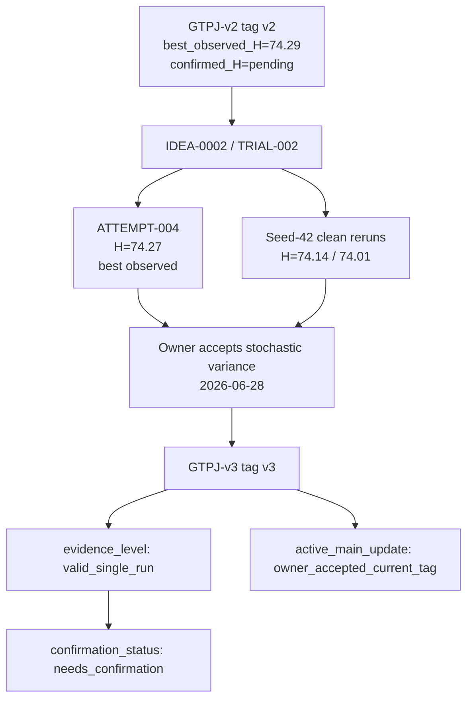

# GTPJ-v3

```text
version: v3
baseline_name: GTPJ-v3
status: owner_accepted_stochastic_unconfirmed
code_tag: v3
parent_version: v2
parent_tag: v2
change_type: add_module
based_on_trial: trial/v2/idea-0002/trial-002
source_trial: experiments/module_trials/IDEA-0002_fae_memory_jepa/TRIAL-002_strict_conditional_jepa
source_attempt: ATTEMPT-004
source_trial_run_commit: c8daa9cb68edcaca3226fe8af3f7fb54757903e4
source_attempt_record_commit: c8daa9cb68edcaca3226fe8af3f7fb54757903e4
ledger_source: dev/v2-idea-0002-trial-002-strict-conditional-jepa
ledger_source_commit: 875cbb634325b2b94fcd09a4f337cd3e90d683f6
code_source: v2 + TRIAL-002 strict main-path FAE-memory JEPA + conditional AG-JEPA text
config: experiments/v3/config.yaml
framework_diagram: experiments/v3/framework_diagram.md
module_glossary: experiments/v3/MODULES.md
baseline_evidence: experiments/v3/baseline/
evidence_level: valid_single_run
best_observed_H: 74.27
confirmed_H: pending
confirmation_status: needs_confirmation
active_main_update: owner_accepted_current_tag
owner_decision_date: 2026-06-28
owner_decision: accept stochastic variance and create formal v3 tag
```

## Current Modules

- Frozen CLIP ViT-L/14@336px backbone
- GPT text description prototypes
- CLIP-A-self sentence-level text prototype adapter inherited from GTPJ-v2
- Patch bottleneck / LastViT patch selection
- FAE geometry-aware visual memory
- Bidirectional visual-text transformer
- Conditional text adaptation
- MSDN local/global distillation
- AG-JEPA auxiliary training
- Strict main-path FAE-memory JEPA context
- Conditional AG-JEPA text predictor input

## Change From Base

`GTPJ-v3` adds the owner-corrected `IDEA-0002 / TRIAL-002` path on top of `GTPJ-v2`:

- AG-JEPA context uses kept positions from the main forward path `jepa_memory`.
- AG-JEPA target remains detached masked pre-FAE `patch_z`.
- Positive and negative AG-JEPA text inputs use sample-conditioned text.
- `jepa_context_mode: fae_main_memory` and `jepa_text_mode: conditional` are explicit in the version config.
- Logits shape, class order, label mapping, seen/unseen split, and GZSL metric semantics are unchanged.

## Results

| Dataset | Seed | U | S | H | ZS | Best epoch | Evidence |
|---|---:|---:|---:|---:|---:|---:|---|
| CUB GZSL | 5 | 71.22 | 77.60 | 74.27 | 81.38 | 33 | `log:v2:module_trial:TRIAL-002:attempt-004` |

```text
evidence_level: valid_single_run
best_observed_H: 74.27
confirmed_H: pending
confirmation_status: needs_confirmation
```

Clean seed-42 reruns after the config/diagram freeze reached `H=74.14` and `H=74.01`. The owner explicitly accepts this as stochastic variance for a formal tag, but the result is still not a strict confirmed baseline.

## Quality Notes

- Owner accepted stochastic variance on 2026-06-28 and requested a formal tag.
- `H=74.27` is recorded as `best_observed_H`, not `confirmed_H`.
- `promotion_decision` remains blocked for baseline-grade claims until a future confirmation/multi-seed protocol upgrades the evidence.
- The version is safe to reference as an owner-accepted `v3` code snapshot, but manuscript-grade confirmed claims must still cite the confirmation gap.

## Version Tree Position

```text
parent_version: v2
children: none yet
notes: v3 = v2 + IDEA-0002/TRIAL-002 strict conditional FAE-memory JEPA; owner accepted stochastic variance.
```

## Framework Diagram

```text
framework_diagram: framework_diagram.md
module_glossary: MODULES.md
source_trial_framework: experiments/module_trials/IDEA-0002_fae_memory_jepa/TRIAL-002_strict_conditional_jepa/framework_diagram.md
```

The version-level diagram summarizes the v3 active method state; the source trial diagram remains the detailed implementation artifact.

## Version Flow



## Allowed Experiment Types

- `tune/`
- `ablation/`
- `confirmation/`
