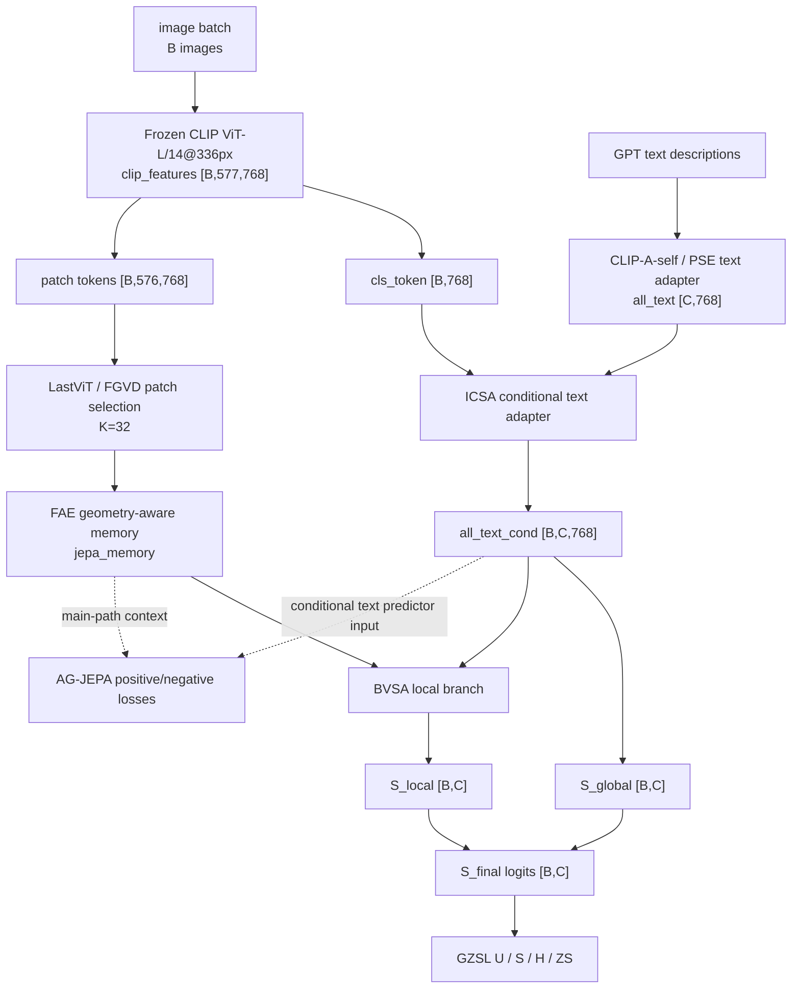

# GTPJ-v3 Framework Diagram

```text
version: v3
parent_version: v2
based_on_trial: experiments/module_trials/IDEA-0002_fae_memory_jepa/TRIAL-002_strict_conditional_jepa
config: experiments/v3/config.yaml
module_glossary: MODULES.md
code_vs_intent: v3 adds strict main-path FAE-memory JEPA context and conditional AG-JEPA text input on top of v2.
```

## Main Forward Flow



## Variable Glossary

| Variable | Source | Shape | Meaning |
|---|---|---|---|
| `B` | dataloader | scalar | image/sample count |
| `C` | CUB class set | `200` | class count |
| `all_text` | inherited CLIP-A-self/PSE adapter | `[C,768]` | class prototypes before image conditioning |
| `all_text_cond` | ICSA | `[B,C,768]` | sample-conditioned class prototypes |
| `selected_patches` | LastViT/FGVD selection | `[B,K,768]` | selected local visual tokens |
| `jepa_memory` | FAE main-path encoder | implementation-dependent local memory | visual context read by AG-JEPA |
| `S_global` | global scorer | `[B,C]` | global class score |
| `S_local` | BVSA/local branch | `[B,C]` | local visual-semantic score |
| `S_final` | fusion | `[B,C]` | final logits |

## Module Glossary

See `MODULES.md`. v3's new contribution is the strict use of main-path FAE memory in AG-JEPA plus conditional text for the auxiliary predictor.

## Loss And Training Flow

The schedule is `lr_stages = 20 + 20 + 10` planned epochs. The `epochs: 30` field is historical metadata and must not be quoted as the total training length.

## GZSL Hard Rules

```text
seen/unseen split: unchanged
class order: unchanged
label mapping: unchanged
metric semantics: unchanged
logits shape: [B (image/sample count), C (class count)]
unseen label leakage: forbidden
```
