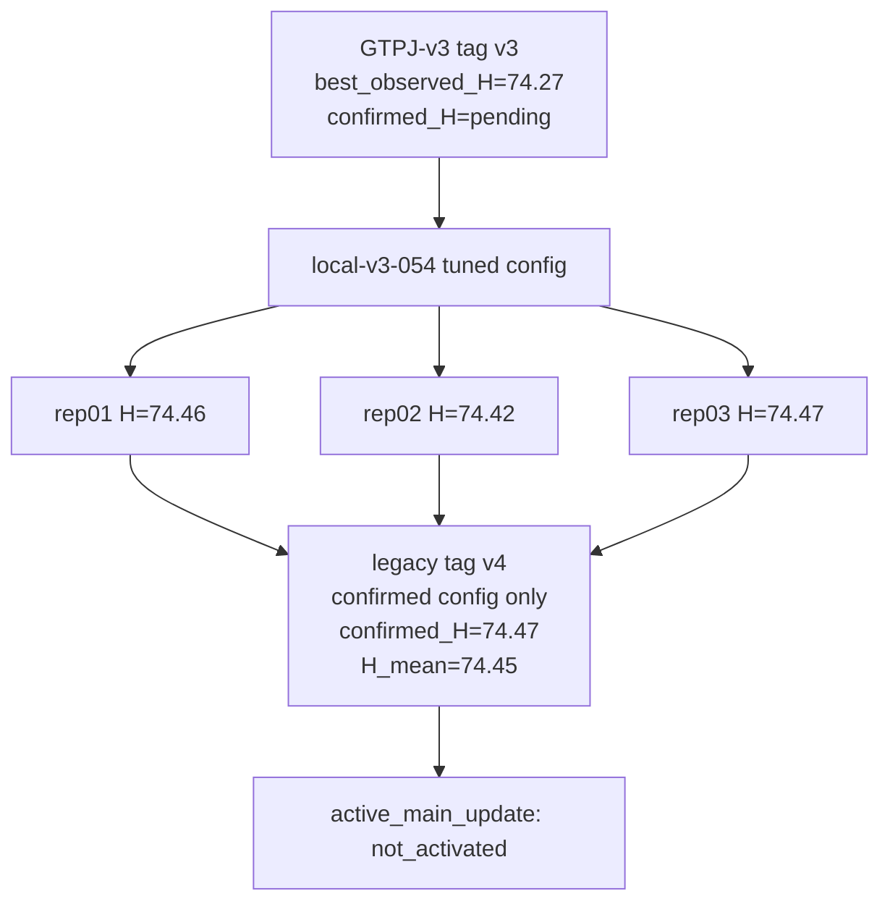

# GTPJ-v4

```text
version: v4
baseline_name: GTPJ-v4
status: legacy_config_only_not_framework_version
code_tag: v4
parent_version: v3
parent_tag: v3
change_type: legacy_config_tag
based_on_trial: none
source_experiment: experiments/v3/confirmation/CONFIRM-001_local_v3_054_min3
source_candidate: local-v3-054
source_run: RUN-20260629-1722-server-gpu0-local-top2-min3
source_run_commit: 13529cb1d3ed8405e2f5cbb4832eff8d1c78db16
ledger_source: promote/v3-to-v4-local-v3-054
code_source: v3 model/training code + confirmed tuned config
config: experiments/v4/config.yaml
framework_diagram: experiments/v4/framework_diagram.md
module_glossary: experiments/v4/MODULES.md
baseline_evidence: experiments/v4/baseline/
evidence_level: baseline_grade
best_observed_H: 74.47
confirmed_H: 74.47
H_mean: 74.45
confirmation_status: confirmed
active_main_update: not_activated
owner_decision_date: 2026-06-29
owner_decision: legacy record only; pure tuning/config-only confirmations do not create formal framework versions.
```

## Current Modules

- Frozen CLIP ViT-L/14@336px backbone
- GPT text description prototypes
- PSE / CLIP-A-self sentence-level text prototype adapter
- FGVD geometry-aware visual memory
- BVSA bidirectional visual-semantic alignment
- ICSA conditional text adaptation
- SGMP auxiliary training

## Change From Base

`GTPJ-v4` is retained as a historical tag for the min3-confirmed `local-v3-054` tuned configuration on top of `GTPJ-v3`:

- `pse_outer_ratio` / `clip_a_self_outer_ratio`: `0.15 -> 0.5`
- `local_weight`: `0.3 -> 0.1`

No model/training code, class order, seen/unseen split, label mapping, logits shape, or GZSL metric semantics are changed. Under the current project rule, this means the result is a confirmed config under `v3`, not a new formal framework version.

## Results

| Dataset | Repeats | Official U | Official S | H values | confirmed_H | H mean | Official ZS |
|---|---:|---:|---:|---|---:|---:|---:|
| CUB GZSL | 3 | 71.53 | 77.66 | 74.46 / 74.42 / 74.47 | 74.47 | 74.45 | 81.25 |

```text
evidence_level: baseline_grade
best_observed_H: 74.47
confirmed_H: 74.47
H_mean: 74.45
confirmation_status: confirmed
```

## Quality Notes

- The source confirmation completed 3 clean server repeats with H metrics.
- The GitHub record stores only config/result/manifest/quality evidence; raw logs and receipts remain in Warehouse.
- This directory is a legacy/historical config-only record. It must not be used as precedent for creating `vX` from pure tuning.

## Version Tree Position

```text
parent_version: v3
children: none yet
notes: v4 is a historical config-only tag for v3/CONFIRM-001 local-v3-054, not a formal framework version.
```

## Framework Diagram

```text
framework_diagram: framework_diagram.md
module_glossary: MODULES.md
framework_status: legacy_config_only_not_framework_version
```

The diagram explicitly marks v4 as a historical config-only record, not a new framework version.

## Version Flow



## Allowed Experiment Types

- `tune/`
- `ablation/`
- `confirmation/`
