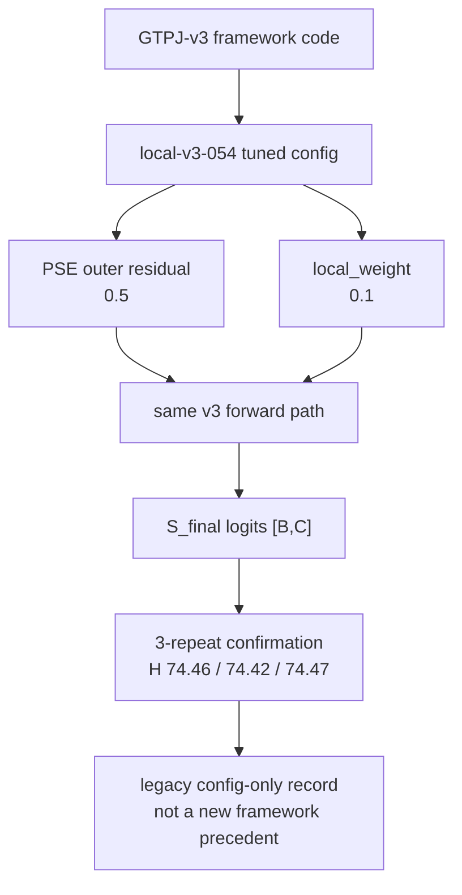

# GTPJ-v4 Framework Diagram

```text
version: v4
parent_version: v3
status: legacy_config_only_not_framework_version
source_experiment: experiments/v3/confirmation/CONFIRM-001_local_v3_054_min3
config: experiments/v4/config.yaml
module_glossary: MODULES.md
code_vs_intent: v4 is a historical config-only tag; it does not introduce a new framework.
```

## Main Forward Flow



## Variable Glossary

| Variable | Source | Shape | Meaning |
|---|---|---|---|
| `B` | dataloader | scalar | image/sample count |
| `C` | CUB class set | `200` | class count |
| `all_text` | inherited v3 text path | `[C,768]` | class prototypes |
| `all_text_cond` | inherited v3 ICSA | `[B,C,768]` | sample-conditioned class prototypes |
| `S_global` | inherited v3 global scorer | `[B,C]` | global class score |
| `S_local` | inherited v3 local branch | `[B,C]` | local class score |
| `S_final` | inherited fusion with tuned `local_weight` | `[B,C]` | final logits |

## Module Glossary

See `MODULES.md`. This record exists to explain a historical config-only tag, not to define a new method state.

## Loss And Training Flow

The schedule remains `lr_stages = 20 + 20 + 10`. Do not read the historical `epochs: 30` field as the actual total training length.

## GZSL Hard Rules

```text
seen/unseen split: unchanged
class order: unchanged
label mapping: unchanged
metric semantics: unchanged
logits shape: [B (image/sample count), C (class count)]
unseen label leakage: forbidden
```
