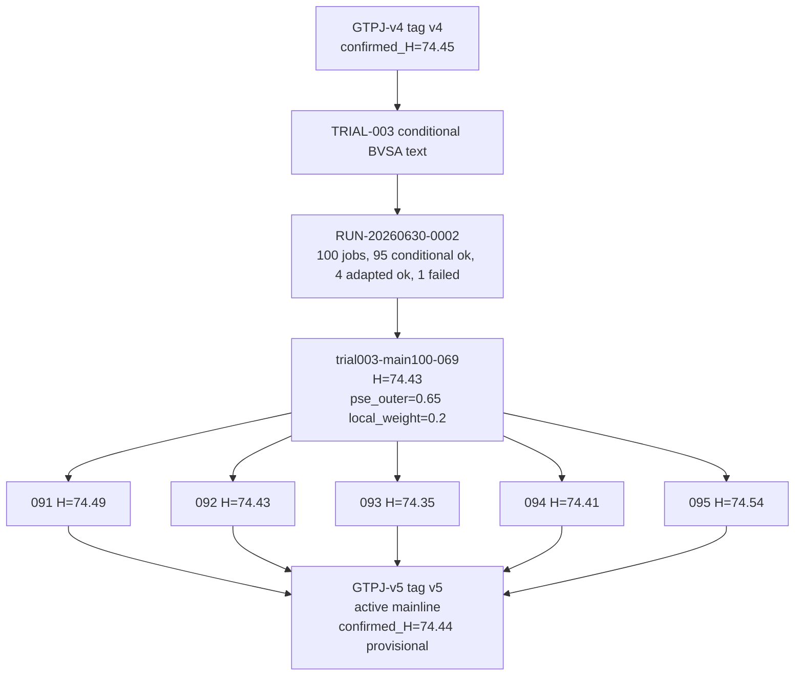

# GTPJ-v5

```text
version: v5
baseline_name: GTPJ-v5
status: owner_activated_provisional
code_tag: v5
parent_version: v4
parent_tag: v4
change_type: combo
based_on_trial: experiments/module_trials/IDEA-0002_fae_memory_jepa/TRIAL-003_conditional_bvsa_text
source_experiment: RUN-20260630-0002-trial003-main100-2gpu
source_candidate: trial003-main100-069
source_run_commit: 4b259379d99c1a791442ea9e2fac0bb22b2411a9
implementation_source: dev/v3-idea-0002-trial-003-conditional-bvsa-text@4b259379d99c1a791442ea9e2fac0bb22b2411a9
ledger_source: main owner activation on 2026-06-30
code_source: TRIAL-003 conditional BVSA text implementation + trial003-main100-069 config
config: experiments/v5/config.yaml
baseline_evidence: experiments/v5/baseline/
evidence_level: confirmation_grade
best_observed_H: 74.54
confirmed_H: 74.44
confirmation_status: owner_activated_provisional
active_main_update: activated
owner_decision_date: 2026-06-30
owner_decision: make the best TRIAL-003 conditional BVSA text candidate the active mainline for future tuning, while keeping v4 as the stronger confirmed reference.
```

## Current Modules

- Frozen CLIP ViT-L/14@336px backbone
- GPT text description prototypes
- PSE / CLIP-A-self sentence-level text prototype adapter
- FGVD geometry-aware visual memory
- BVSA bidirectional visual-semantic alignment
- ICSA conditional text adaptation
- SGMP auxiliary training
- Conditional BVSA text routing: `all_text_cond [B, C, 768] -> BVSA cross/local_score`

## Change From Base

`GTPJ-v5` activates the TRIAL-003 code path and freezes the strongest observed same-config candidate from the 100-run batch:

- `bvsa_text_mode`: `adapted -> conditional`
- BVSA cross/local score text input: `all_text -> all_text_cond`
- `pse_outer_ratio` / `clip_a_self_outer_ratio`: `0.5 -> 0.65`
- `local_weight`: `0.1 -> 0.2`

The config still keeps ICSA, SGMP, and JEPA text modes conditional. No class order, seen/unseen split, label mapping, logits shape, or GZSL metric semantics are changed by this activation.

## Results

| Dataset | Source | U | S | H | ZS | best_epoch | Status |
|---|---|---:|---:|---:|---:|---:|---|
| CUB GZSL | `trial003-main100-069` | 71.90 | 77.16 | 74.43 | 81.62 | 34 | source config |
| CUB GZSL | best frozen repeat `trial003-main100-095` | 72.13 | 77.11 | 74.54 | 81.65 | 34 | best_observed |
| CUB GZSL | frozen repeats 091-095 mean | 72.00 | 77.07 | 74.44 | 81.56 | mixed | provisional repeat mean |

```text
evidence_level: confirmation_grade
best_observed_H: 74.54
confirmed_H: 74.44
reference_v4_confirmed_H: 74.45
delta_repeat_mean_vs_v4_confirmed_H: -0.01
delta_best_observed_vs_v4_confirmed_H: +0.09
confirmation_status: owner_activated_provisional
```

## Quality Notes

- The best single observed run is `trial003-main100-095`, a frozen repeat of source config `trial003-main100-069`.
- The 5 frozen repeats give mean `H=74.44`, which is effectively tied with but slightly below `GTPJ-v4 confirmed_H=74.45`.
- Therefore `GTPJ-v5` is the active owner-selected mainline for future tuning, not a stronger confirmed baseline claim over `GTPJ-v4`.
- Raw logs, receipts, checkpoints, and full runtime outputs remain in Warehouse.

## Version Tree Position

```text
parent_version: v4
children: none yet
notes: v5 = v4 governance parent + TRIAL-003 conditional BVSA text code + trial003-main100-069 tuned config.
```

## Version Flow



## Allowed Experiment Types

- `tune/`
- `ablation/`
- `confirmation/`
