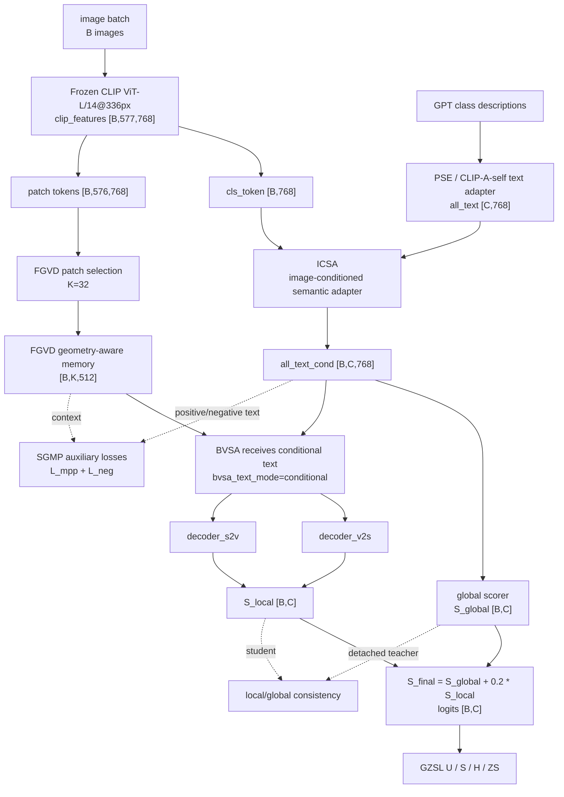

# GTPJ-v5 Framework Diagram

```text
version: v5
parent_version: v3
based_on_trial: experiments/module_trials/IDEA-0002_fae_memory_jepa/TRIAL-003_conditional_bvsa_text
source_experiment: RUN-20260630-0002-trial003-main100-2gpu
source_candidate: trial003-main100-069
config: experiments/v5/config.yaml
module_glossary: MODULES.md
html_view: framework_diagram.html
trial_framework_source: experiments/module_trials/IDEA-0002_fae_memory_jepa/TRIAL-003_conditional_bvsa_text/framework_diagram.md
code_vs_intent: v5 activates the TRIAL-003 path where all_text_cond is routed directly into BVSA.
```

## Main Forward Flow



## Variable Glossary

| Variable | Source | Shape | Meaning |
|---|---|---|---|
| `B` | dataloader | scalar | image/sample count |
| `C` | CUB class set | `200` | class count |
| `clip_features` | frozen CLIP image encoder | `[B,577,768]` | CLS plus patch tokens |
| `all_text` | PSE / CLIP-A-self text adapter | `[C,768]` | adapted class text prototypes |
| `all_text_cond` | ICSA applied to `all_text` with image CLS token | `[B,C,768]` | per-image conditional class prototypes |
| `selected_patches` | FGVD patch selection | `[B,K,768]`, K=32 | local visual tokens selected for BVSA |
| `FGVD memory` | geometry-aware local encoder | `[B,K,512]` | local visual memory consumed by BVSA and SGMP |
| `S_global` | cosine/global scorer | `[B,C]` | global class score from CLS and conditional text |
| `S_local` | BVSA decoders | `[B,C]` | local visual-semantic score |
| `S_final` / logits | score fusion | `[B,C]` | final logits; train may slice seen classes for CE |
| `L_mpp`, `L_neg` | SGMP | scalar | auxiliary masked prediction and negative suppression losses |

## Module Glossary

See `MODULES.md` for the detailed purpose/input/output/config/baseline-off table. The critical v5 change is:

```text
v3-style BVSA text input: all_text [C,768]
v5 active BVSA text input: all_text_cond [B,C,768]
```

This makes the image-conditioned semantic adapter affect both the global score and the BVSA local branch.

## Loss And Training Flow

The effective training schedule comes from:

```text
lr_stages: 20 + 20 + 10 = 50 planned epochs
```

`epochs: 30` remains in the config as a historical field and must not be used as the total epoch count when planning or explaining a run.

## GZSL Hard Rules

```text
seen/unseen split: unchanged
class order: unchanged
label mapping: unchanged
metric semantics: unchanged
logits shape: [B (image/sample count), C (class count)]
unseen label leakage: forbidden
baseline-off: bvsa_text_mode=adapted returns BVSA to the shared-text path.
```
