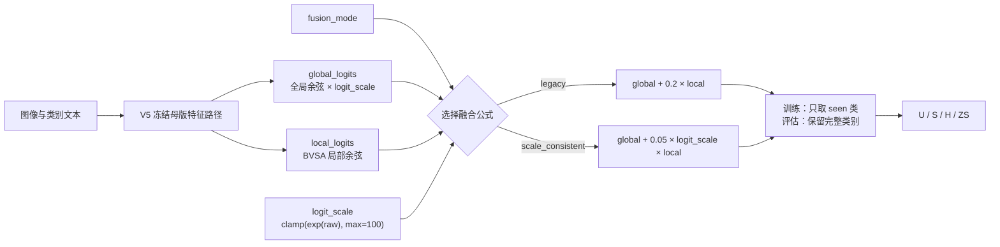

# V5-INNOVATION-002：尺度一致的局部融合

## 短结论

这个实验只改最后一步融合：旧路线保持 `global_logits + 0.2 * local_logits`，新路线固定为 `global_logits + 0.05 * logit_scale * local_logits`。先跑 seed 5 的三组同配置重复；只有所有预设门槛都通过，才继续 seed 17 和 29。

当前状态是 `planned`，尚未启动训练，也没有指标或结论。

## 现在要回答的问题

V5 的全局分数乘了 CLIP 的温度尺度 `logit_scale`，局部分数没有。旧代码直接把两种量级的分数相加，局部项可能天然太小。已完成的 `V5-ABLATION-001` 又显示，局部分支对 H 的三个同 seed 差值只有 `+0.25/-0.09/+0.09`，均值 `+0.08`。

因此，本实验不再往局部分支里堆新模块，只检验一个能被数据推翻的假设：局部分支贡献小，是否主要因为最终分数量级不一致。

## 唯一新机制

```text
scale_consistent:
final_logits = global_logits + 0.05 * logit_scale * local_logits
```

模型里的 `logit_scale` 实际取值是 `clamp(exp(raw_logit_scale), max=100)`。`0.05` 在看结果前已经固定，本实验不做系数搜索。

对照路线完全保留母版语义：

```text
legacy:
final_logits = global_logits + 0.2 * local_logits
```

PSE、ICSA、BVSA、FGVD、SGMP、CLIP 编码器和原有损失均来自 V5 母版，不是本实验的新创意。

## 两阶段运行顺序

第一阶段固定按下面顺序串行运行，防止两条路线争用 GPU：

| 顺序 | RUN | 路线 | seed | 说明 |
|---:|---|---|---:|---|
| 1 | `RUN-001` | legacy | 5 | 第 1 次 |
| 2 | `RUN-002` | scale-consistent | 5 | 第 1 次 |
| 3 | `RUN-003` | legacy | 5 | 精确重复 RUN-001 |
| 4 | `RUN-004` | scale-consistent | 5 | 精确重复 RUN-002 |
| 5 | `RUN-005` | legacy | 5 | 精确重复 RUN-001 |
| 6 | `RUN-006` | scale-consistent | 5 | 精确重复 RUN-002 |

第一阶段的三个同 seed 配对分别是 `001↔002`、`003↔004`、`005↔006`。同一个 seed 跑三次，是先检查相同条件下的运行重复性；它不能代替跨 seed 检查。

只有第一阶段全部通过，才按顺序启动第二阶段：

| 顺序 | RUN | 路线 | seed |
|---:|---|---|---:|
| 7 | `RUN-007` | legacy | 17 |
| 8 | `RUN-008` | scale-consistent | 17 |
| 9 | `RUN-009` | legacy | 29 |
| 10 | `RUN-010` | scale-consistent | 29 |

## 第一阶段门槛

下面条件必须同时成立，缺一条都停止，不启动 `RUN-007` 至 `RUN-010`：

1. `RUN-001` 至 `RUN-006` 全部正常完成，没有 NaN、Inf、OOM、非零退出码或关键证据缺失。
2. 三次 legacy 的平均 H 必须落在 `74.17 ± 0.30` 内；否则先判为复现或环境问题，不能用它评价新机制。
3. 三组配对的 `scale H - legacy H` 都必须大于 `0`。
4. 三组配对的平均 `ΔH` 必须至少为 `+0.50`。
5. scale-consistent 三次结果中的最小 H 必须高于 legacy 三次结果中的最大 H。
6. scale-consistent 的平均 U 相比 legacy 不能下降超过 `0.30`，平均 S 也不能下降超过 `0.30`。

若任一条件失败，后四行记为 `stage1_gate_failed_not_started`。代码、配置、日志和失败结论全部保留，不删除历史，也不把未启动任务写成训练失败。

## 第二阶段与最终判断

第二阶段结束后，先把 seed 5 的三次重复求平均，把它当作一个 seed 级数据点；seed 17 和 seed 29 各自是另外一个数据点。最终按 seed 5、17、29 等权汇总，避免 seed 5 因为跑了三次而被重复加权。

最终只有在平均 `ΔH ≥ +0.50`，并且三个 seed 的方向为正且一致时，才把尺度一致融合保留为后续候选。这个实验标记为 `not_confirmation_evidence: true`，不能冒充正式确认或 promotion 证据。

## 不允许改变的内容

- 不改数据集、seen/unseen 划分、类别顺序和标签映射。
- 不改损失、优化器、训练轮数、学习率日程和评估口径。
- 不改 canonical `train_GTPJ_CUB.py` 和 canonical V5 配置。
- 不根据测试结果改 `fusion_beta=0.05`。
- 不覆盖已有 RUN 目录，不续跑、不复用旧输出目录。

## 输出位置与防覆盖

每个任务只写入独立目录：

```text
.runtime/runs/v5/innovation/V5-INNOVATION-002_scale_consistent_fusion/RUN-xxx/
```

每个目录至少应有 `training.log`、`metrics.json`、`config_snapshot.yaml`、`run_identity.json`、`model_best.pth` 和 `checkpoint_last.pth`。运行入口发现目标目录已经存在时必须直接拒绝，绝不覆盖。

入口还会在创建目录前检查系统可用物理内存；少于 14 GiB 或读不到可信数值时直接停止，因为本实验需要一次载入约 9.84 GiB 特征缓存。

仓库的 `evidence/README.md` 只记录这些目录的位置和检查办法；checkpoint、大日志和缓存不进 Git。

## Code Flow Diagram



可独立打开的同图版本见 `framework_diagram.html`。

## 复核入口

- 实验身份：`EXPERIMENT.yaml`
- 逐任务参数：`PARAMETER_MATRIX.csv` 与 `configs/RUN-xxx.yaml`
- 代码来源边界：`module_source.md`
- 实现与回退：`implementation.md`
- 质量门：`quality_check.md`
- 结果占位：`result.md`
