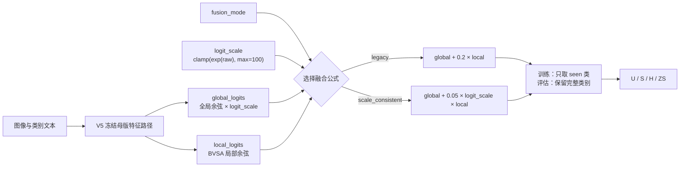

# 框架图：尺度一致的局部融合

这张图只强调本实验改动的最后一步。图像、文本和局部分支内部结构全部继承自 V5；红色含义由文字中的 `scale_consistent` 路线承担，不把继承模块包装成新模块。

## 读图顺序

1. V5 母版先产生全局分数和局部分数。
2. `fusion_mode` 决定走原公式还是尺度一致公式。
3. 两条路线之外的训练与评估流程完全相同。
4. 最终只比较 U、S、H、ZS 和预先写死的 Stage1 门槛。

同一张图的本地独立页面见 `framework_diagram.html`。
