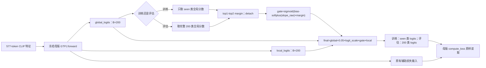

# Framework Diagram：低置信度局部增强

这里的 `Framework Diagram` 是本创新的前向路径图。它只解释新增 gate 如何接在 V5 母版后面，不把实验候选画成新的正式框架。

## 代码位置

| 路径 | 输入 | 输出 | 不变边界 |
|---|---|---|---|
| `confidence_local_gate.py::_compute_confidence_gate` | 全局分数、训练/评估标志 | gate、已 detach 的 margin | 不读标签，不改类别顺序 |
| `confidence_local_gate.py::forward` | 母版输出 | 新 final/logits/clip_S_pp 与 gate 统计 | 原有辅助张量全部保留 |
| `train.py::_evaluate_with_gate_stats` | 原评估 helper 与模型 | 原 U/S/H/ZS 加 gate 汇总 | 仍调用 `evaluate_cached_v5` |
