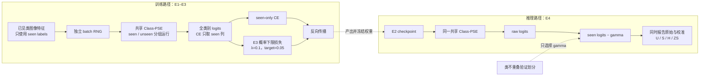

# 框架图：PSE 类别关系增强与两类校准

这张图只说明一件事：E3 会反向传播并改变模型，E4 只复用 E2 权重移动推理判决线，两者不能混写成同一个模块。

## 图中事实来源

| 标签 | 来源 |
|---|---|
| 旧 PSE 没有类别间依赖 | 本任务反事实探针：修改类别 A 后其他类别输出 `max delta=0.0` |
| seen-only CE | `model/MyModel.py::compute_loss` 及针对性单元测试 |
| E3 概率下限 | `lambda_self_calibration=0.1`、`self_calibration_target=0.05` |
| E4 seen logits − gamma | Chao 等人的 calibrated stacking 定义；实现位于 `tools/v5_evaluation.py` |
| gamma 只来自验证划分 | `select_calibrated_stacking_gamma(split_name="validation", ...)` 的硬检查 |

可编辑源文件是 `framework_diagram.drawio`；本地浏览入口是 `framework_diagram.html`。
