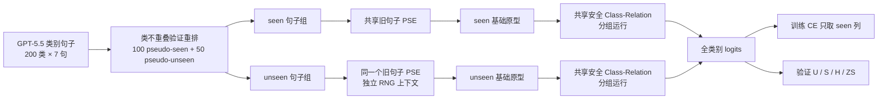

# 框架图：对称、限幅的 PSE 类别关系验证



## 三组开关

| 组别 | seen 路径 | unseen 路径 | 类别关系 |
|---|---|---|---|
| R0 | 旧句子 PSE | 原始句子均值 | 无 |
| R1 | 旧句子 PSE | 同一个旧句子 PSE | 无 |
| R2 | 旧句子 PSE | 同一个旧句子 PSE | 同一安全模块、两组分别运行 |

## 安全 Class-Relation

```text
base = normalize(PSE(sentences))
relation = MHA(LayerNorm(base))
correction = 0.1 * relation / max(norm(relation), 1)
output = normalize(base + correction)
```

- MHA 输出投影为零初始化，R2 起点与 R1 完全相同。
- 每类修正范数硬限制为 `<=0.1`，对应最大旋转约 `5.75°`。
- seen/unseen 共享权重但不联合注意，训练交叉熵不使用 unseen 标签。
- 选择 R0/R1/R2 时不加载正式测试缓存。

可编辑源文件 `framework_diagram.drawio` 保留第一版历史结构；第二版权威结构以本文件及 `implementation.md` 为准，本地浏览版为 `framework_diagram.html`。
