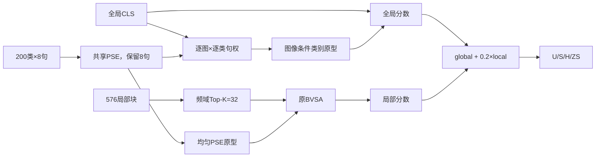

# V5-INNOVATION-009：图像条件 PSE + 原局部分支

```yaml
framework: FRAMEWORK-V5
idea_id: IDEA-0011
status: planned
base_template: MODEL-V5-TEMPLATE-V1
branch: exp/v5/innovation/innovation-009-image-conditioned-pse
parameter_matrix: PARAMETER_MATRIX.md
promoted_framework: none
```

## 要回答的问题

只让全局 CLS 为每个候选类别的 8 句话分配权重，能否比 V5 的“同一图像偏移加到全部已见类别”更有效，同时保持局部贡献稳定。

## 固定比较条件

- CUB、同一 xlsa17 划分、CLIP `[B,577,768]` 缓存；
- 同一 `[200,8,768]` 文本缓存，SHA-256 为 `8c1a8e27...b6bca3`；
- Top-K=32、seed=5、batch=64、50 epoch、学习率日程完全相同；
- PSE、BVSA、SGMP、`global + 0.2 * local` 和现有损失权重不变；
- 不新增 global/local CE，不改变 U/S/H/ZS、类别顺序或 label mapping。

## Code Flow Diagram

这张图只说明实际代码路径；完整 shape 和方法解释见 `framework_diagram.md`。



关键隔离条件：条件原型只进入全局分数；BVSA 和 SGMP 使用静态均匀 PSE 原型。因此本实验确实只回答“全局选句是否足够”。

## 运行与诊断

`RUN-001` 额外记录真实类别的平均 8 句权重、相对 `1/8` 的偏差、条件/均匀原型余弦、三路分数绝对均值、训练时间、参数量、模型文件大小和 CUDA 峰值显存。

## 结论边界

单次结果只能说明候选是否值得继续；若要判断稳定提升或 promotion，必须登记同配置独立进程复跑。
