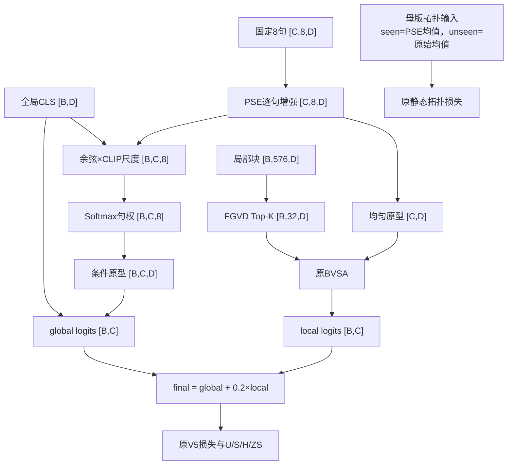

# Framework Diagram：图像条件 PSE

本图说明实验 A 的张量流和隔离边界。可直接打开的本地版本是 `framework_diagram.html`。

## 关键不变量

- `B` 始终是图片数，`C` 始终按全局类别顺序；训练时只切 seen 列。
- seen/unseen 都用同一个 PSE；没有未见图像或标签进入训练。
- 条件原型不进入 BVSA，防止实验问题从“全局选句”漂移成“全局和局部共同选句”。
- 拓扑损失继续读取母版的 seen-PSE/unseen-raw 静态原型，不读取全类条件原型或全类均匀 PSE 原型。
- PSE、Top-K、训练日程和损失权重与实验 B 相同。
