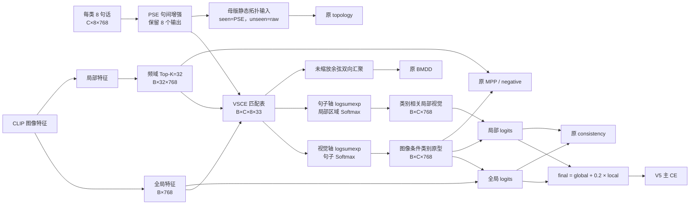

# V5-INNOVATION-010 方法框架图

本图记录已经实现并按目标测试复核的 PSE + VSCE 代码和张量流；图不能替代正式训练结果。

## Framework Diagram

“Framework Diagram”指方法框架图，用来说明 8 句文本、全局图像、Top-K 局部区域怎样进入同一匹配表，并最终生成分类分数和原有 V5 损失。



## 关键变量

| 变量 | 普通话解释 |
|---|---|
| `M[b,c,m,n]` | 第 `b` 幅图像、第 `c` 个候选类别、第 `m` 句话与第 `n` 个视觉位置的匹配分数。 |
| `sentence_weight` | 当前图像面对当前候选类别时，8 句话各占多少。 |
| `region_weight` | 当前候选类别面对当前图像时，32 个局部区域各占多少。 |
| `prototype` | 根据当前图像动态生成的类别文本原型。 |
| `local_visual` | 根据当前类别动态汇聚的局部视觉特征。 |

分数尺度刻意保持 V5 约定：匹配表和全局 logits 使用 CLIP `logit_scale`，局部 logits 保持原始余弦量级，最后再乘固定权重 `0.2`。

BMDD 不读取放大后的 `logsumexp` 证据，而读取未缩放余弦表导出的两路 `[-1,1]` 分数；topology 继续读取母版的 seen-PSE/unseen-raw 静态原型。前向始终计算 200 类，训练损失再切 seen 列。

## 与 V5 的差异

```text
保留：CLIP、PSE、频域 Top-K、0.2 局部融合、全部现有损失与评估口径。
替换：ICSA 的独立偏移、独立 BVSA。
新增：一张共享匹配表和由它导出的句子/区域双向权重。
```

## Code Flow Diagram

“Code Flow Diagram”指实际代码路径。当前接入点是文本缓存加载、PSE 输出、模型前向交互和诊断输出；正式精度仍以服务器运行结果为准。

```text
8句缓存 + CLIP视觉缓存
-> shape/身份检查
-> PSE句子序列 + 全局/TopK32视觉
-> VSCE匹配与双向权重
-> global/local/final logits
-> V5原损失
-> U/S/H/ZS + 时间/显存/模型大小
```
