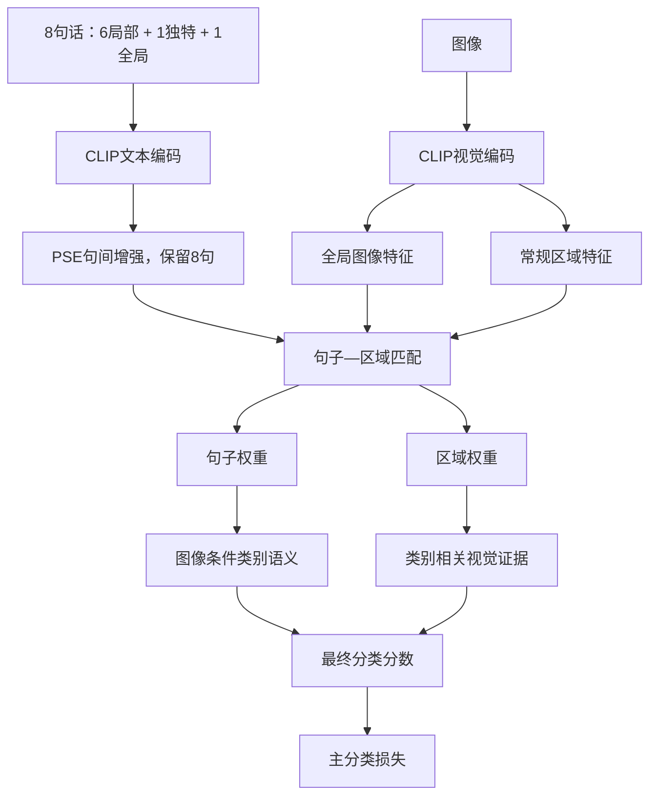

# V5-INNOVATION-011 方法框架图

```mermaid
flowchart TD
  I["图像"] --> V["CLIP视觉编码"]
  V --> G["全局图像特征"]
  V --> R["常规区域特征"]
  T["8句话：6局部 + 1独特 + 1全局"] --> E["CLIP文本编码"]
  E --> P["PSE句间增强，保留8句"]
  P --> M["句子—区域匹配"]
  G --> M
  R --> M
  M --> SW["句子权重"]
  M --> RW["区域权重"]
  SW --> C["图像条件类别语义"]
  RW --> L["类别相关视觉证据"]
  C --> S["最终分类分数"]
  L --> S
  S --> CE["主分类损失"]
```

图中刻意没有频域 Top-K、ICSA、BVSA、SGMP、BMDD、拓扑损失和辅助损失。这个候选先证明核心框架是否合理。
