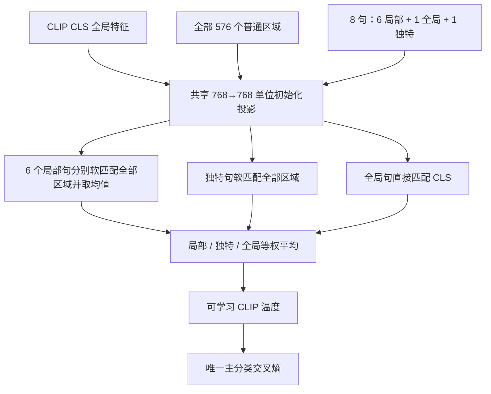

# V5-INNOVATION-011 方法框架图

```mermaid
flowchart TD
  C["CLIP CLS 全局特征"] --> P["共享 768→768 单位初始化投影"]
  R["全部 576 个普通区域"] --> P
  T["8 句：6 局部 + 1 全局 + 1 独特"] --> P
  P --> L["6 个局部句分别软匹配全部区域并取均值"]
  P --> U["独特句软匹配全部区域"]
  P --> G["全局句直接匹配 CLS"]
  L --> A["局部 / 独特 / 全局等权平均"]
  U --> A
  G --> A
  A --> S["可学习 CLIP 温度"]
  S --> CE["唯一主分类交叉熵"]
```

没有 PSE、Top-K、频域处理、ICSA、BVSA、SGMP、BMDD、拓扑或辅助损失。
