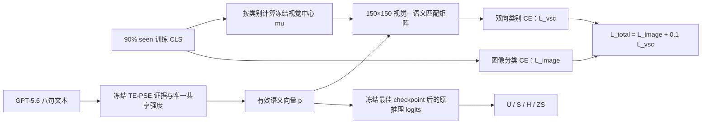

# V5-INNOVATION-016：TE-PSE + VSC-Loss

```text
status: completed_stop_no_gain
parent_module: V5-INNOVATION-015 TE-PSE
parent_commit: b7f060afdd6d42baeee25b4d3068389085d88286
formal_training_started: true
run_commit: 3e91d348abb82fab8c9046c73f55de0252a56ee7
```

## 唯一问题

在完全冻结 TE-PSE 的文本、rival、角色权重、共享强度参数化和推理公式后，只给训练增加一个固定权重 `0.1` 的类别级视觉—语义双向中心一致性损失，能否相对 TE-PSE 提高 raw GZSL H，并避免只拟合 seen？

## 唯一变化

- 每个 seen 类只使用 90% 训练子集的冻结 CLIP 图像特征计算一个归一化视觉中心。
- 用 TE-PSE 的同一组有效类别向量形成 `150×150` 类别匹配矩阵。
- 增加视觉中心到语义原型、语义原型到视觉中心的对称 CE，固定 `lambda_vsc=0.1`。
- validation 仍只用原来的 10% seen CE 选择 checkpoint；official tensor 仍在 checkpoint 冻结后加载。

不新增模型参数，不改变推理公式，不加入 gamma、visual adapter、patch、局部分支、topology 或其他损失。

## Code Flow Diagram

这张图只描述本实验相对冻结 TE-PSE 新增的训练期损失路径；推理路径仍完全等于
`V5-INNOVATION-015`。



完整张量、公式、baseline-off 行为和 GZSL 边界见 `framework_diagram.md`。

## 预先判定

- 相对 `V5-INNOVATION-015/RUN-001` 比较完整 `U/S/H/ZS`，不是只和 B0 比。
- H 不升，或只抬高 S 且继续损害 U，则 `stop_no_gain`。
- 只有 H 相对 TE-PSE 有正信号且 unseen 边界没有进一步恶化，才进入 seed 17 与打乱类别对应的负控制。

## 稍后启动命令

```powershell
conda run -n dvsr_gpu python experiments/v5/innovation/INNOVATION-016_te_pse_vsc/train.py `
  --config experiments/v5/innovation/INNOVATION-016_te_pse_vsc/config.yaml `
  --run-dir <WAREHOUSE>/runs/v5/innovation/V5-INNOVATION-016/RUN-001 `
  --expected-commit <FROZEN_COMMIT> `
  --run-id RUN-001
```
