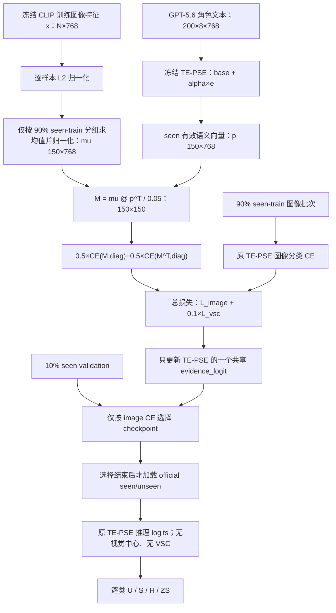

# V5-INNOVATION-016 框架图

本页说明 VSC-Loss 在冻结 TE-PSE 上的唯一接入点。它用于核对代码是否真的只增加训练约束，
不把新模块偷偷带入推理路径。

## Framework Diagram

## 变量与接口

| 名称 | shape | 来源 | 用途 |
|---|---|---|---|
| `train_features` | `N×768` | 冻结 CLIP CLS cache | 图像分类训练及视觉中心计算 |
| `train_indices` | `N_train` | 固定 seed 的逐类 90/10 划分 | 唯一允许进入视觉中心的样本索引 |
| `visual_centroids` | `150×768` | 每个 seen 类的训练 CLS 均值 | VSC 左侧类别表示；不参与推理 |
| `effective_class_vectors` | `200×768` | TE-PSE 的实际 `base + alpha×e` | 与推理完全共用的语义向量 |
| `matching` | `150×150` | seen 视觉中心与 seen 语义向量点积 | 双向类别匹配 CE |
| `evidence_logit` | 标量 | TE-PSE 唯一可训练参数 | 决定全类别共享、有界的证据强度 |

## Baseline-off 行为

当 `vsc_weight=0` 时，总损失严格退化为父实验 `V5-INNOVATION-015` 的图像分类 CE；模型、
参数化、checkpoint 选择和推理公式均不变化。本冻结运行固定 `vsc_weight=0.1`，不做搜索。

## GZSL 边界

- 视觉中心只读取 90% seen 训练样本；10% validation 与 official seen/unseen 都不能进入中心。
- checkpoint 只按 10% seen validation image CE 选择，VSC 数值和 official H 都不参与选模。
- official seen/unseen tensors 在恢复最佳 checkpoint 后才加载，并只执行预注册的一次评估。
- 训练与推理的类别顺序都由冻结的 `seenclasses` / `unseenclasses` 映射决定；指标保持逐类平均。
- seen 与 unseen 推理使用同一个 TE-PSE 公式；VSC 不创建类别专属参数或第二套 prototype。

## 代码与意图对应

- `class_visual_centroids` 实现 90% seen-train 中心。
- `visual_semantic_consistency_loss` 实现同一推理向量上的 `150×150` 对称匹配。
- `run` 中的训练循环只在原 CE 后加 `0.1×L_vsc`；恢复 `best_state` 后才进入 official 评估。
