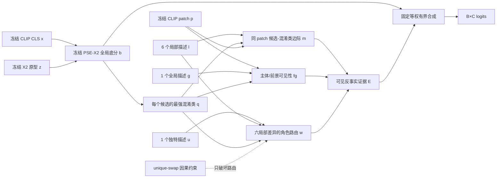

# VCER 框架图

八句话不是八个对称分支，而是一个具有三种职责的证据路由器：六个局部描述产生
可检验的区域差异，全局描述判断区域是否属于主体，独特描述决定哪些局部差异值得信任。

## 边界

- 文本底座仍是 PSE-X2；VCER 不把 PSE-X2 改名为原创。
- 只有共享低秩投影可学习；没有类别或 split 专属参数。
- `VCER-off` 保留 `logits(image_features, class_ids)` 位置接口，直接走冻结 X2，不读 patch；训练损失只剩底分 CE。
- role-shuffle 只错配“unique 路由权重—六路视觉证据”，不能把二者一起重排后把坐标重命名冒充干预。
- 当前图只描述 VCER；未叠加 HSTB、VEC、CHORM 或其他候选模块。
