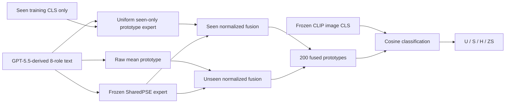

# DPEF 框架

```mermaid
flowchart LR
    T["GPT-5.5-derived 8-role text"] --> R["Raw mean prototype"]
    T --> A["Uniform seen-only prototype expert"]
    T --> B["Frozen SharedPSE expert"]
    X["Seen training CLS only"] --> A
    A --> FS["Seen normalized fusion"]
    B --> FS
    R --> FU["Unseen normalized fusion"]
    B --> FU
    FS --> P["200 fused prototypes"]
    FU --> P
    I["Frozen CLIP image CLS"] --> C["Cosine classification"]
    P --> C
    C --> M["U / S / H / ZS"]
```

边界：没有视觉 adapter、局部分支或 seen-logit gamma；unseen 训练阶段只使用文本原型，不使用 unseen 图像。
