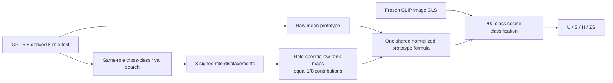

# RCDP 框架图

```mermaid
flowchart LR
    T["GPT-5.5-derived 8-role text"] --> B["Raw mean prototype"]
    T --> R["Same-role cross-class rival search"]
    R --> D["8 signed role displacements"]
    D --> L["Role-specific low-rank maps<br/>equal 1/8 contributions"]
    B --> P["One shared normalized prototype formula"]
    L --> P
    X["Frozen CLIP image CLS"] --> C["200-class cosine classification"]
    P --> C
    C --> M["U / S / H / ZS"]
```

RCDP 不接收 seen/unseen 标识；同一个模型、同一组参数和同一条公式处理全部候选类别。
