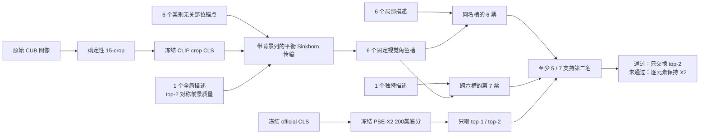

# ARTV 框架图

本地可直接打开的同图版本见 `framework_diagram.html`。

## 方法边界

- 八句话是 `6 局部 + 1 全局 + 1 独特`，不是八个对称分支。
- PSE-X2 只负责冻结全局原型；ARTV 是其后的无训练验证器。
- ARTV 不修改 X2 top-2 之外的分数，不使用类别/split 参数和 gamma。
- role-shuffle 固定视觉槽，仅打乱六个局部描述；unique-swap 只破坏第七票。
