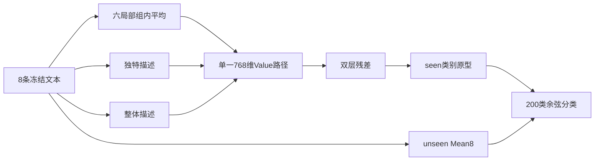

# Framework Diagram

```mermaid
flowchart LR
  T[8条冻结文本] --> L[六局部组内平均]
  T --> U[独特描述]
  T --> G[整体描述]
  L --> V[单一768维Value路径]
  U --> V
  G --> V
  V --> R[双层残差]
  R --> S[seen类别原型]
  T --> M[unseen Mean8]
  S --> C[200类余弦分类]
  M --> C
```

“单一Value路径”不包含Q/K attention。
