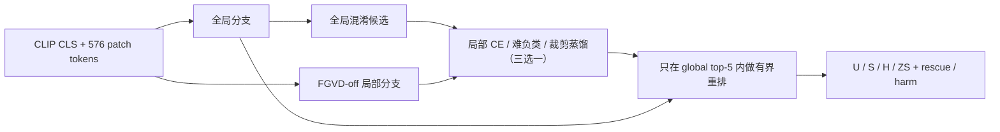

# 局部证据修复流程图

```mermaid
flowchart LR
    A["CLIP CLS + 576 patch tokens"] --> G["全局分支"]
    A --> L["FGVD-off 局部分支"]
    G --> C["全局混淆候选"]
    C --> N["局部 CE / 难负类 / 裁剪蒸馏（三选一）"]
    L --> N
    N --> R["只在 global top-5 内做有界重排"]
    G --> R
    R --> M["U / S / H / ZS + rescue / harm"]
```

训练时三个新增监督一次只启用一个；推理重排不读取标签。
